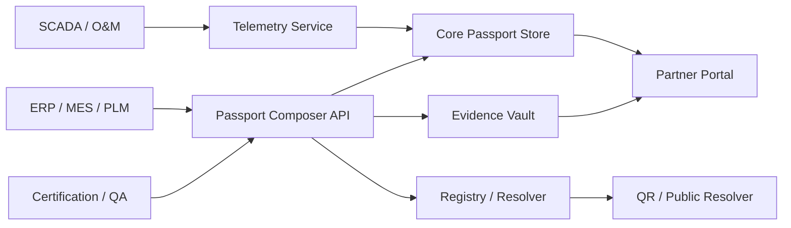

# Reference Architecture

## Architectural recommendation
Use a **hybrid architecture**.

## Why hybrid is best
A pure centralized design is easy but weaker for cross-company trust.
A pure blockchain design is expensive, rigid, and poor for high-volume documents and telemetry.
A hybrid design gives:
- strong interoperability
- lower cost
- better privacy
- selective immutability
- easier enterprise integration

## Reference stack

### Layer 1 — Resolution and registry
Purpose:
- resolve QR / data carrier
- expose latest passport pointer
- store status and manifest references

Recommended contents:
- passport ID
- product ID
- latest manifest hash
- latest public endpoint
- lifecycle status
- revocation / supersession flags

Possible implementation:
- conventional trusted registry service
- optional blockchain anchoring for hash commitments

### Layer 2 — Core passport store
Purpose:
- hold structured passport JSON
- manage versions
- role-based access control
- approval workflow

Recommended technology:
- PostgreSQL / document store
- object storage for large files
- API gateway

### Layer 3 — Evidence and document vault
Purpose:
- store declarations, certificates, manuals, test reports, EPDs
- preserve integrity hashes
- enable signed retrieval and access control

### Layer 4 — Trust and verification layer
Purpose:
- represent issuers and certifiers
- verify claims cryptographically
- support machine-verifiable documents

Recommended standards:
- DID Core
- Verifiable Credentials

### Layer 5 — Telemetry and lifecycle intelligence layer
Purpose:
- connect SCADA / IoT / monitoring
- store summaries and pointers
- avoid bloating the core passport with raw time series

### Layer 6 — Integration layer
Connectors to:
- ERP
- MES
- PLM
- LCA/EPD systems
- certification systems
- recycler portals
- customer portals

## Access-control model

### Public
- identity
- manufacturer
- top-level specs
- declarations/certificates summary
- warranty
- general EoL guidance

### Legitimate-interest users
- detailed composition
- dismantling data
- recycler-facing data
- selected operational summaries

### Authorities / auditors
- deeper evidence
- approval logs
- restricted facility/supply-chain records
- complete compliance trace

## Static vs dynamic handling

### Static data
Store as structured passport snapshots.

### Dynamic data
Do not continuously rewrite the full passport for every telemetry event.
Instead:
- store time-series elsewhere
- periodically summarize into passport fields
- link evidence manifests by hash

## Minimal architecture diagram

## Build recommendation
For the first release, keep blockchain **optional**.
Make the product successful even without blockchain, then enable anchoring where customer trust and cross-party auditability justify it.
