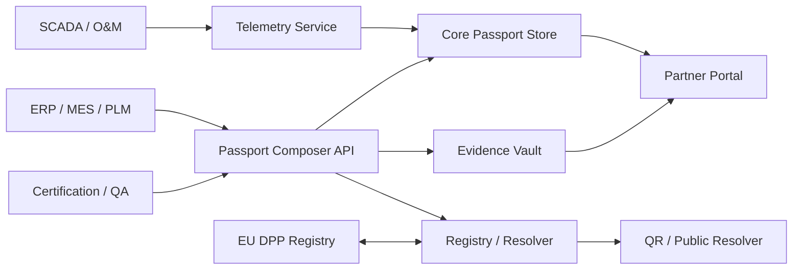

# HelioTrail — PV Digital Product Passport: Complete Product Specification

> **Version:** 1.0 | **Date:** 2026-04-09 | **Status:** Living Document
>
> This is the **single definitive reference** for building the HelioTrail PV Digital Product Passport platform. It consolidates all internal documentation, external research, regulatory analysis, competitive intelligence, and technical specifications into one actionable document.

---

## Table of Contents

1. [Executive Summary](#1-executive-summary)
2. [Market Opportunity & Strategic Position](#2-market-opportunity--strategic-position)
3. [Regulatory Landscape](#3-regulatory-landscape)
4. [Industry Initiatives & Consortiums](#4-industry-initiatives--consortiums)
5. [Competitor & Industry Benchmarking](#5-competitor--industry-benchmarking)
6. [Product Vision & Scope](#6-product-vision--scope)
7. [Product Requirements](#7-product-requirements)
8. [PV Passport Data Schema](#8-pv-passport-data-schema)
9. [BOM & Dynamic Data Design](#9-bom--dynamic-data-design)
10. [Reference Architecture](#10-reference-architecture)
11. [Technical Standards & Interoperability](#11-technical-standards--interoperability)
12. [Carbon Footprint & Sustainability Data](#12-carbon-footprint--sustainability-data)
13. [Circularity & End-of-Life](#13-circularity--end-of-life)
14. [Battery Passport Benchmark](#14-battery-passport-benchmark)
15. [Waaree Energies Case Study](#15-waaree-energies-case-study)
16. [Frontend Product Blueprint](#16-frontend-product-blueprint)
17. [Information Architecture & Navigation](#17-information-architecture--navigation)
18. [Screen Specifications](#18-screen-specifications)
19. [Design System & Component Library](#19-design-system--component-library)
20. [User Flows & States](#20-user-flows--states)
21. [Data Binding & API Contracts](#21-data-binding--api-contracts)
22. [Implementation Roadmap](#22-implementation-roadmap)
23. [Platform Critique & Gap Analysis](#23-platform-critique--gap-analysis)
24. [Research Sources](#24-research-sources)

---

## 1. Executive Summary

### What is HelioTrail?

HelioTrail is a **production-grade Digital Product Passport (DPP) SaaS platform purpose-built for photovoltaic (PV) solar modules**. It is the **only PV-specific DPP platform globally**, positioned to capture the market before EU regulations make PV passports mandatory.

### Why Now?

- The **EU ESPR** (Ecodesign for Sustainable Products Regulation) entered force in 2024, establishing the horizontal DPP framework
- The **EU DPP central registry launches July 19, 2026** — HelioTrail has a 3-month window to be production-ready
- Battery passports become mandatory **February 18, 2027** — PV will follow
- The **ESIA (European Solar PV Industry Alliance)** is actively pushing for mandatory PV DPP
- PV waste will exceed **80 million tonnes by 2050** — circularity data is commercially valuable, not just regulatory
- DPP market projected to grow from **$2.4B (2025) to $10.8B (2035)**

### Strategic Conclusion

1. **There is not yet a battery-passport-equivalent PV schema** — PV does not have the same level of sector-specific, regulated schema maturity. This is HelioTrail's opportunity to define the standard.
2. **The safest product strategy is a tiered schema** — separating regulatory core, industry-consensus extensions, and advanced lifecycle intelligence.
3. **The best technical pattern is hybrid** — structured cloud storage + integrity hashes + DID/VC for trust + optional blockchain anchoring.
4. **The frontend must be a real SaaS product** — not a document viewer or compliance spreadsheet.

### Current Platform Status: 62% Complete

| Area | Completion | Notes |
|------|-----------|-------|
| Public passport experience | 95% | Landing, QR resolver, 5 public sections — polished |
| Dashboard | 90% | Hero KPIs, compliance gauge, charts, fleet widgets |
| Passport workspace (9 tabs) | 85% | All major sections exist |
| Create passport wizard | 90% | 6-step wizard, Waaree dropdowns, auto-fill |
| Design system | 85% | 63 components, Swiss-minimal aesthetic |
| Dynamic data analytics | 95% | 10 chart types, scatter plots, degradation bands |
| Data schema (Supabase) | 70% | 5 tables, 45+ passport fields |
| REST API layer | 0% | **BLOCKER** — no business logic layer |
| Partner/recycler views | 0% | **HIGH** — none of 4 restricted views built |
| RBAC enforcement | 0% | **HIGH** — types defined but not enforced |

---

## 2. Market Opportunity & Strategic Position

### Market Size

- Global DPP platform market: **$2.4B (2025) → $10.8B (2035)**, CAGR 16-36%
- Cloud-based deployment holds 64.1% of market revenue
- Europe accounts for 36.29% of the global market

### HelioTrail's Unique Position

HelioTrail is **the only PV-specific DPP platform** in the market. All competitors focus on batteries, plastics, automotive, or generic supply chains:

| Competitor | Focus | PV-Specific? |
|-----------|-------|-------------|
| Circularise | Multi-industry, FAIR PV pilot | Pilot only |
| Circulor | Batteries, automotive | No |
| Spherity | Batteries (Catena-X certified) | No |
| iPoint-systems | Compliance, sustainability | No |
| SAP Green Token | ERP-integrated supply chain | No |
| Siemens Xcelerator | Battery passport | No |
| R-Cycle | Plastics packaging | No |
| Narravero | Multi-industry DPP-as-a-Service | No |

### Competitive Advantages

1. **PV-specific data model** — tailored schema for solar module lifecycle
2. **Dynamic telemetry analytics** — no competitor has real-time performance data in DPP
3. **Waaree Energies as launch customer** — India's largest PV manufacturer (22.3 GW capacity)
4. **Professional Swiss-minimal design** — enterprise-grade, investor/demo ready
5. **EU ESPR-aligned 3-layer schema** — regulatory core + industry extensions + advanced intelligence
6. **First-mover timing** — ready before July 2026 EU DPP registry deadline

### Go-to-Market Strategy

Position as **"the Battery Pass, but for solar"** — leveraging Battery Pass consortium brand recognition while owning the PV vertical.

**Key talking points:**
- Only PV-specific DPP platform globally
- EU ESPR-aligned data model (3-layer schema)
- Real-time performance analytics (no competitor has this)
- Waaree Energies as launch customer / reference
- Ready before the July 2026 EU DPP registry deadline

---

## 3. Regulatory Landscape

### 3.1 ESPR (EU) 2024/1781 — The Horizontal DPP Framework

**Source:** https://eur-lex.europa.eu/eli/reg/2024/1781/eng

The ESPR provides the foundational DPP requirements applicable to all product groups:

| Requirement | Status | Implication for PV |
|------------|--------|-------------------|
| Persistent unique product identifier | **Firm** | Must implement ISO/IEC 15459 / GS1 compliant IDs |
| Data carrier (QR, RFID, NFC) | **Firm** | QR code on physical product required |
| Interoperability | **Firm** | Open APIs, standard data exchange formats |
| Access and update rights controlled | **Firm** | Role-based access tiers |
| Data integrity, authentication, security | **Firm** | Hashing, signing, audit trails |
| Product-group-specific data fields | **Via delegated acts** | PV delegated act not yet published |

**Critical timeline:**
- **April 2025:** ESPR Working Plan (2025-2030) published — PV modules are NOT in the first wave of priority product groups
- **July 19, 2026:** EU DPP central registry deployment
- **2028:** Mid-term review — likely inflection point for adding PV
- **2028-2030:** Industry consensus timeline for mandatory PV DPP

**Omnibus Simplification (2025):** The EU's deregulation wave scaled back CSRD significantly but **left the DPP framework untouched**. DPP requirements remain fully on track.

### 3.2 ESPR Working Plan Priority Products (2025-2030)

| Product Group | Expected Delegated Act |
|--------------|----------------------|
| Iron and steel | 2026 |
| Textiles/Apparel | 2027 |
| Tyres | 2027 |
| Furniture | 2028 |
| Aluminium | 2028 |
| EV chargers | 2028 |
| Electric motors | 2028 |
| Mobile phones and tablets | 2030 |
| **Solar PV modules** | **Not explicitly listed — likely 2028-2030** |

### 3.3 EU Batteries Regulation 2023/1542 — The Template

**Source:** https://eur-lex.europa.eu/legal-content/EN/TXT/?uri=CELEX%3A32023R1542

The most mature real-world EU passport model. Proves the viability of:
- Public / legitimate-interest / authority access tiers
- Model-level + item-level + use-phase information
- QR-linked passport access
- Controlled update and integrity mechanisms
- Mandatory from **February 18, 2027**

**Practical takeaway:** Use the battery passport as the **architectural template**, but do not claim PV has the same legal data obligations yet.

### 3.4 ESPR Article Requirements vs HelioTrail

| ESPR Requirement | HelioTrail Status | Gap |
|-----------------|-------------------|-----|
| **Art. 8: Unique product identifier** (ISO/IEC 15459) | `pv_passport_id` + `public_id` exist | Align ID format with ISO 15459 / GS1 |
| **Art. 8: Physical data carrier** (QR on product) | QR removed from UI | Need "Generate Label" feature |
| **Art. 9: EU DPP Registry compatibility** | Not implemented | Must support registry API (July 2026) |
| **Art. 10: Data access rights** (role-based) | Types defined, enforcement missing | RBAC must be implemented |
| **Art. 10: Audit trail** | History tab is a stub | Must track all changes with attribution |
| **Material composition by weight %** | Implemented | BOM table has mass_g and mass_percent |
| **Country of manufacturing** | `manufacturer_country` field exists | Implemented |
| **Carbon footprint (kg CO2e)** | `carbon_footprint_kg_co2e` exists | Implemented |
| **Recycling/EoL instructions** | Circularity table implemented | Implemented |
| **Repairability/durability index** | Missing | Add `repairability_score` field |
| **Importer/authorized rep info** | Missing from schema | Only manufacturer tracked |

### 3.5 Related EU Regulatory Frameworks

#### REACH
- Substances of very high concern (SVHC) communication
- Article-level substance transparency
- Structured BOM/substance model is highly valuable

#### RoHS
- Hazardous substance compliance signalling
- Product and market documentation layers

#### WEEE Directive
- PV modules classified as electronic waste since 2012
- Collection target: **85% of waste generated** (or 65% of equipment put on market)
- Material recovery target: **85% by weight**
- Reuse and recycling target: **80% by mass**
- Strong case for dismantling and recovery data in the passport

#### Construction Products Regulation
- Relevant for building-integrated PV (BIPV) use cases

### 3.6 PV Carbon Footprint Rules (NEW — July 2025)

The EU Joint Research Centre (JRC) published **harmonized rules for calculating PV module carbon footprint**:

- **Functional unit:** grams of CO2 equivalent per kWh (gCO2eq/kWh) of electricity produced
- **Range:** 10.8 to 44 gCO2eq/kWh depending on manufacturing conditions
- **Major carbon sources:** electricity for silicon manufacturing, silicon content, aluminium frame, glass, panel lifetime
- **Methodology:** EU Environmental Footprint method and PV-specific PEFCR
- **Significance:** "One of the first steps on the path to introducing mandatory carbon footprint requirements at product level"

### 3.7 Regulatory Certainty Classification

#### Treat as mandatory-ready (high certainty)
- Unique product / passport identity
- Economic operator identification
- Core product specifications
- Compliance documentation links
- Instruction / safety document access
- Integrity model and access control
- Versioning / auditability

#### Treat as industry-consensus (medium certainty)
- BOM and material composition
- Substances-of-concern details
- Facility-level provenance
- Dismantling and EoL instructions
- Due-diligence reports
- Chain-of-custody events
- Carbon footprint declaration

#### Treat as advanced / forward-looking (low certainty)
- Real-time telemetry
- Module-level operating analytics
- Degradation prediction models
- Asset marketplace reuse scoring
- Digital twin integration

### 3.8 Lifecycle-Stage Reporting Obligations

| Lifecycle Stage | Data Obligations |
|----------------|-----------------|
| **Manufacturing** | Product identity, manufacturer, facility, specs, declarations, certificates, material profile |
| **Distribution / placing on market** | Importer/distributor references, lot/batch/shipment traceability, market-specific documentation |
| **Use phase** | Owner/operator linkage, maintenance events, performance summaries, fault/incident history |
| **End of life** | Collection route, dismantling guidance, recycler receipt, recovery outcomes, disposal evidence |

---

## 4. Industry Initiatives & Consortiums

### 4.1 European Solar PV Industry Alliance (ESIA) — PV Passport Program

The ESIA has published two landmark documents:

**PV Passport Journey I** (June 2024): "Paving the way — Understanding Solar PV as a Preliminary Step Toward Implementing a PV Module Passport"

**PV Passport Journey II** (November 2024): "Implementation of a Mandatory Digital Product Passport (DPP) for Solar PV in the EU"

**Proposed PV Passport components:**
- Product information
- Material inventory (critical raw materials: silicon, silver, indium + toxic/heavy metal disclosure)
- Carbon footprint (CO2) and circularity calculator
- Traceability
- Value chain process management
- Circular economy tools
- Partnerships with certified recyclers
- Disassembly/recycling instructions

**Sources:**
- https://solaralliance.eu/wp-content/uploads/2024/11/ESIA-PV-Passport-II.pdf
- https://solaralliance.eu/wp-content/uploads/2024/06/ESIA-PV-Passport_13062024.pdf

### 4.2 PV DPP Pilot Projects

#### RETRIEVE Project (Horizon Europe)
- **Partners:** 18 partners from 10 countries
- **Lead:** Bern University of Applied Sciences (BFH)
- **Key partners:** Fraunhofer CSP, Sisecam (Turkey), Iberdrola (Spain), TotalEnergies (France), IFE (Norway)
- **DPP standard:** ISO 59040 (Product Circularity Data Sheet)
- **Methodology:** Survey of 70 industry experts + 15 in-depth stakeholder interviews
- **Data model:** Material composition, recyclability information, supplier transparency
- **Architecture:** Modular system with role-based access
- **Status:** Integrating partner datasets; real-world pilot testing planned

#### FAIR PV Project (Netherlands) — Most Advanced Solar DPP
- **Partners:** Biosphere Solar, AMS Institute, TU Delft, Circularise
- **Timeline:** May 2024 - April 2026
- **Achievement:** World's first fully repairable, refurbishable, and transparently sourced PV module
- **DPP specification:** **176 data classes and 131 properties**
- **Technology:** Circularise's Smart Questioning for confidential data sharing
- **Infrastructure:** Blockchain-backed material provenance
- **Data scope:** Static (BOM, toxic substances, raw material origin, recycled content) AND dynamic (real-time energy output, repair history, degradation, health predictions)
- **Testing:** Innovation Pavilion in Amsterdam

**Source:** https://www.circularise.com/case-studies/building-a-transparent-solar-future-how-circularise-and-fair-pv-pioneered-circularity-with-digital-product-passports

### 4.3 PV Cycle

Europe's primary producer responsibility organization for solar PV:
- Collection, transport, and waste treatment of end-of-life PV panels
- Centralized registration and reporting platform for EU-27 and UK
- Producer registration in national WEEE/Battery registers
- Periodic reporting on behalf of producers

**Source:** https://pvcycle.org/pv-cycle-europe-services

### 4.4 Fraunhofer CSP

- PV module material passport identified as key topic for 2025
- **PVConnect project:** Unified, interoperable data foundation connecting all life phases of PV power plants
- Active in the RETRIEVE project consortium
- Focus on failure diagnostics, reliability analysis, and material characterization

**Source:** https://www.csp.fraunhofer.de/en/areas-of-research/material-analytics/material-passport-photovoltaics.html

### 4.5 ETIP PV

European Technology and Innovation Platform for Photovoltaics:
- 200+ experts across the PV value chain
- Key working groups: reliability and circularity, digital solar PV systems
- Exploring PV module design for circularity and state-of-the-art recycling
- Strategic Research and Innovation Agenda covers quality assurance, field performance, asset bankability
- 2025 Conference addressed EU 2030 targets: 720 GWdc deployment, 30 GW manufacturing capacity

**Source:** https://etip-pv.eu/

### 4.6 Catena-X

- Primarily automotive-focused; no direct solar PV expansion found
- Provides open, standardized DPP foundation
- DPP Expert Group addressing ESPR, ELVR, Battery Regulation integration
- Eclipse Tractus-X reference implementation on GitHub
- Spherity + RCS Global: first Catena-X certified Battery Passport solution

### 4.7 CEA-INES (France)

- One of Europe's largest PV R&D facilities (200+ CEA employees, 100 industrial partners)
- "Design for recycle" approach: fluorine-free thermoplastic encapsulants, European-origin back sheets
- Internal ECO PV tool for Life Cycle Assessment optimization
- Silver reduction innovations (26% less Ag via electrically conductive adhesives)

### 4.8 SolarPower Europe

- Published EU Solar Industry Strategy recommendations
- Active in sustainability and circularity working groups
- Coordinating with ESIA on PV passport development

---

## 5. Competitor & Industry Benchmarking

### 5.1 Detailed Feature Comparison

| Feature | Circularise | Circulor | SAP Green Token | Spherity | HelioTrail |
|---------|------------|----------|-----------------|----------|------------|
| **PV-specific** | Pilot only (FAIR PV) | No | No | No | **Yes (only dedicated platform)** |
| **Passport creation** | Minutes, no-code | API-driven | ERP-integrated | White-label studio | **6-step wizard + auto-fill** |
| **BOM tracking** | Basic | ML-powered | Deep ERP | Configurable | **10-material template + CRM/SoC flags** |
| **Supply chain** | Blockchain | Blockchain+GPS | Digital twin tokens | DID/VC | **5-stage timeline** |
| **Dashboard analytics** | Basic | Real-time | Enterprise reports | N/A | **10 chart types + fleet intelligence** |
| **IoT/telemetry** | No | No | No | No | **Dynamic data tab** |
| **Recycler view** | No | No | No | No | **Planned (not built)** |
| **ERP integration** | Yes | Yes | Native SAP | API | **Stub only** |
| **Bulk import** | Yes (10k+) | API | Native | API | **Not built** |
| **RBAC** | Yes | Yes | Yes | Yes | **Types only, not enforced** |
| **Architecture** | Blockchain | Blockchain | Cloud/ERP | DID/VC | **Hybrid (cloud + integrity hashing)** |
| **Pricing model** | Enterprise | Enterprise | SAP licensing | Enterprise | **Tiered SaaS** |

### 5.2 DPP Platform Provider Profiles

#### Circularise (Netherlands) — Most Relevant Competitor
- Patented Smart Questioning technology for confidential supply chain data sharing
- Direct solar PV experience through FAIR PV project (176 data classes)
- Blockchain-backed material provenance
- Multi-industry focus limits PV depth

#### Spherity (Germany)
- VERA Studio platform (launched 2023) — white-label DPP management
- W3C DID and Verifiable Credentials approach
- First Catena-X certified Battery Passport solution (with RCS Global)
- Strong in automotive/battery, no PV focus

#### iPoint-systems (Germany)
- 20+ years compliance and sustainability software
- Key role in defining official EU Battery Passport standards
- All-in-one solution for compliance, sustainability, circular economy

#### Narravero (Germany)
- DPP-as-a-Service platform, founded 2013
- 200+ customers across 12+ industries
- White-label ready, multimedia DPP support
- Partnership with Identiv for hardware/NFC integration

#### Circulor (UK)
- Hyperledger Fabric blockchain-based traceability
- Clients: Volvo, Polestar, Volkswagen, Daimler, BMW
- Partnership with Rockwell Automation
- Focus: battery materials, automotive, tires

#### Siemens Xcelerator
- Battery Passport solution (launched 2024)
- Integrates IT and OT platforms
- Claims 80% of EU DPP data requirements
- No PV-specific offering

### 5.3 HelioTrail Competitive Moat

**No competitor offers all of these together for PV:**
1. PV-specific data model with 3-layer schema
2. Dynamic telemetry analytics (10 chart types)
3. Waaree-tailored wizard with auto-fill
4. Professional Swiss-minimal enterprise design
5. Integrated circularity/recycling workspace
6. Both static and dynamic data in one passport

---

## 6. Product Vision & Scope

### Product Name
**HelioTrail** — PV Digital Product Passport Platform

### Product Vision
A trusted digital passport platform for photovoltaic modules that combines regulatory compliance, supply-chain traceability, circularity readiness, lifecycle evidence, and operational intelligence.

### Problem Statement
PV modules are moving toward a traceable, circular, evidence-driven market model, but the ecosystem is fragmented:
- Regulations define the DPP framework but not a fully mature PV-specific schema
- Manufacturing, compliance, recycling, and performance data live in disconnected systems
- Recyclers and refurbishers lack machine-readable dismantling and material data
- Installers and buyers struggle to verify origin, compliance, and long-term performance evidence

### Target Users

#### Primary
- PV manufacturers (e.g., Waaree Energies, Trina Solar, JA Solar, LONGi)
- Importers / EU economic operators
- Compliance teams
- Quality / certification teams
- Recyclers and producer responsibility organizations (e.g., PV Cycle)

#### Secondary
- EPCs / installers
- Asset owners / operators
- Insurers / financiers
- Auditors / market surveillance bodies
- Circular-economy marketplaces

### Core Product Modules

| Module | Description | Phase |
|--------|------------|-------|
| **Passport registry** | Creation, unique IDs, QR/data carrier resolution, status lookup | MVP |
| **Compliance document vault** | Declarations, certificates, manuals, safety info, hashing | MVP |
| **Material and BOM intelligence** | Module material breakdown, substances of concern, supplier mapping | MVP |
| **Supply-chain and due-diligence** | Actor registry, facilities, supplier tiers, chain-of-custody, audit evidence | Phase 2 |
| **Circularity and EoL** | Dismantling instructions, collection schemes, refurbish/second-life, recovery reporting | Phase 2 |
| **Performance layer** | Telemetry connectors, degradation summaries, maintenance history, anomaly events | Phase 3 |

### Product Editions

| Edition | Target | Includes |
|---------|--------|----------|
| **A — Compliance Core** | Manufacturers beginning DPP readiness | Passport creation, identity, specs, compliance docs, basic BOM |
| **B — Traceability and Circularity** | Supply-chain and EoL intelligence | + supplier tiers, chain-of-custody, due diligence, recycler data |
| **C — Lifecycle Intelligence** | Dynamic performance and predictive analytics | + telemetry, degradation, maintenance history, digital twin |

### Success Metrics
- Time to create passport
- % passports with complete regulatory core
- % passports with verified supporting evidence
- Recycler usability score
- % passports with reusable structured BOM
- Customer onboarding time
- Passport update latency

### Out of Scope for MVP
- Full SCADA platform
- Inverter / plant analytics replacement
- Broad ERP replacement
- Direct certification lab software replacement

---

## 7. Product Requirements

### 7.1 Functional Requirements

| ID | Requirement | Priority |
|----|------------|----------|
| FR-1 | Create unique PV passport (model, batch/lot, individual module) | MVP |
| FR-2 | Resolve QR/data carrier to public/authorized views | MVP |
| FR-3 | Store/reference compliance documents with integrity hashing | MVP |
| FR-4 | Support structured schema (static + materials + supply chain + circularity + dynamic) | MVP |
| FR-5 | Role-based access (public, manufacturer, importer, auditor, recycler, authority, owner, service) | MVP |
| FR-6 | Version all updates with audit history and approval workflows | MVP |
| FR-7 | Hash documents, protect signed fields, maintain provenance | MVP |
| FR-8 | APIs, import/export, JSON schema exchange, optional VC/DID | MVP+ |
| FR-9 | Dismantling instructions, reuse/refurbishment, recycler handover, recovery reporting | Phase 2 |
| FR-10 | Telemetry pointers, cumulative generation, maintenance logs, degradation indicators | Phase 3 |
| FR-11 | Public passport experience (QR resolution, public summary, evidence, circularity) | MVP |
| FR-12 | Authenticated manufacturer workspace (dashboard, list, wizard, evidence, approvals) | MVP |
| FR-13 | Role-aware restricted views (recycler, auditor, authority, operator) | MVP |
| FR-14 | Reusable design system (buttons, cards, tables, steppers, timelines, evidence components) | MVP |
| FR-15 | Accessible and responsive (desktop-first auth, mobile-first public QR) | MVP |
| FR-16 | Data freshness and trust communication (verification status, timestamps, source, approval state) | MVP |

### 7.2 Non-Functional Requirements

| ID | Requirement |
|----|------------|
| NFR-1 | **Security:** Encryption at rest/transit, strong auth, tenant isolation, signed audit logs |
| NFR-2 | **Scalability:** Multiple customers, product lines, millions of modules, high document volumes |
| NFR-3 | **Availability:** High availability for public resolution, backup strategy, archival after inactivity |
| NFR-4 | **Regulatory explainability:** Every field has source, owner, update responsibility, certainty |
| NFR-5 | **Extensibility:** New delegated-act fields without platform redesign |

### 7.3 User Stories

| Persona | Story |
|---------|-------|
| **Compliance manager** | Generate a passport from ERP/MES/PLM data to place products on market with lower manual effort |
| **Recycler** | Access material composition and dismantling guidance to process modules safely and efficiently |
| **Buyer / installer** | Verify identity, compliance, and warranty data from a QR code to trust the product |
| **Auditor / authority** | Access tamper-evident change log and source documents to verify claims |
| **Asset owner** | View current status, maintenance history, and performance to manage fleet operations |

### 7.4 MVP Acceptance Criteria
- Passport can be created and resolved from QR
- Public and restricted views work
- Compliance docs can be attached and hashed
- Material composition can be represented structurally
- EoL / dismantling data can be added
- All changes are auditable
- A user can scan a QR and land on a readable public passport page
- A manufacturer can create a passport through a guided wizard
- An approver can approve or reject a pending update
- A recycler can access recycler-facing material and dismantling data
- Loading, empty, and error states exist for all primary screens
- Component patterns are reused consistently across pages

---

## 8. PV Passport Data Schema

### 8.1 Schema Design Principle

Design the schema in **3 layers** aligned with regulatory certainty:

```
┌─────────────────────────────────────────────────────────┐
│  Layer 3: Advanced Lifecycle Intelligence (low certainty)│
│  Telemetry, degradation, maintenance, digital twin       │
├─────────────────────────────────────────────────────────┤
│  Layer 2: Industry Consensus Extensions (medium certainty)│
│  BOM, substances, carbon, supply chain, circularity      │
├─────────────────────────────────────────────────────────┤
│  Layer 1: Regulatory Core (high certainty)               │
│  Identity, operators, facilities, specs, compliance docs │
└─────────────────────────────────────────────────────────┘
```

### 8.2 Layer 1 — Regulatory Core Fields (High Certainty)

#### Identity
| Field | Type | Description |
|-------|------|------------|
| `pvPassportId` | string | Unique passport identifier |
| `moduleIdentifier` | string | Module-level identifier |
| `serialNumber` | string | Serial number |
| `batchId` | string | Batch/lot identifier |
| `modelId` | string | Product model identifier |
| `gtin` | string | GS1 Global Trade Item Number |
| `dataCarrierType` | enum | QR, DataMatrix, RFID, NFC |
| `passportVersion` | string | Current version |
| `passportStatus` | enum | draft, under_review, approved, published, superseded, archived, decommissioned |

#### Economic Operators
| Field | Type | Description |
|-------|------|------------|
| `manufacturer.name` | string | Legal name |
| `manufacturer.operatorIdentifier` | string | EU economic operator ID |
| `manufacturer.address` | object | Registered address |
| `manufacturer.contactUrl` | string | Contact URL |
| `importer.name` | string | EU importer name |
| `importer.operatorIdentifier` | string | Importer ID |
| `authorizedRepresentative` | object | EU authorized rep |
| `distributor[]` | array | Distribution chain |

#### Facilities
| Field | Type | Description |
|-------|------|------------|
| `manufacturingFacility.facilityIdentifier` | string | Facility ID |
| `manufacturingFacility.name` | string | Facility name |
| `manufacturingFacility.location` | object | Country, address, coordinates |
| `manufacturingDate` | ISO-8601 | Date of manufacture |

#### Product Technical Data
| Field | Type | Unit | Description |
|-------|------|------|------------|
| `moduleCategory` | enum | — | Mono, poly, thin-film, etc. |
| `moduleTechnology` | enum | — | PERC, TOPCon, HJT, CIGS, CdTe |
| `ratedPowerSTC_W` | number | W | Nameplate power at STC |
| `moduleEfficiency_percent` | number | % | Module efficiency |
| `voc_V` | number | V | Open-circuit voltage |
| `isc_A` | number | A | Short-circuit current |
| `vmp_V` | number | V | Voltage at max power |
| `imp_A` | number | A | Current at max power |
| `maxSystemVoltage_V` | number | V | Max system voltage |
| `moduleDimensions_mm` | object | mm | Length x width x depth |
| `moduleMass_kg` | number | kg | Module mass |

#### Compliance and Documentation
| Field | Type | Description |
|-------|------|------------|
| `declarationOfConformity` | object | URI + hash + hashAlg |
| `technicalDocumentationRef` | object | Reference to tech docs |
| `certificates[]` | array | IEC, UL, BIS certifications |
| `userManual` | object | URI + hash |
| `installationInstructions` | object | URI + hash |
| `safetyInstructions` | object | URI + hash |

### 8.3 Layer 2 — Industry Consensus Fields (Medium Certainty)

#### BOM and Material Composition
```json
{
  "moduleMaterials": [
    {
      "materialName": "tempered glass",
      "componentType": "front_cover",
      "mass_g": 12000,
      "massPercent": 62.5,
      "casNumber": null,
      "isCriticalRawMaterial": false,
      "supplierId": "SUP-001",
      "recyclabilityHint": "fully_recyclable"
    },
    {
      "materialName": "aluminium",
      "componentType": "frame",
      "mass_g": 1800,
      "massPercent": 9.4,
      "casNumber": null,
      "isCriticalRawMaterial": false,
      "supplierId": "SUP-002",
      "recyclabilityHint": "fully_recyclable"
    },
    {
      "materialName": "crystalline silicon",
      "componentType": "solar_cell",
      "mass_g": 600,
      "massPercent": 3.1,
      "casNumber": "7440-21-3",
      "isCriticalRawMaterial": true,
      "supplierId": "SUP-003",
      "recyclabilityHint": "recoverable"
    },
    {
      "materialName": "silver",
      "componentType": "cell_metallization",
      "mass_g": 12,
      "massPercent": 0.06,
      "casNumber": "7440-22-4",
      "isCriticalRawMaterial": true,
      "supplierId": "SUP-004",
      "recyclabilityHint": "recoverable"
    },
    {
      "materialName": "copper",
      "componentType": "interconnects",
      "mass_g": 120,
      "massPercent": 0.6,
      "casNumber": "7440-50-8",
      "isCriticalRawMaterial": false,
      "supplierId": "SUP-005",
      "recyclabilityHint": "recoverable"
    },
    {
      "materialName": "EVA",
      "componentType": "encapsulant",
      "mass_g": 1800,
      "massPercent": 9.4,
      "casNumber": "24937-78-8",
      "isCriticalRawMaterial": false,
      "supplierId": "SUP-006",
      "recyclabilityHint": "not_recyclable"
    },
    {
      "materialName": "backsheet (polymer)",
      "componentType": "rear_cover",
      "mass_g": 600,
      "massPercent": 3.1,
      "casNumber": null,
      "isCriticalRawMaterial": false,
      "supplierId": "SUP-007",
      "recyclabilityHint": "limited"
    }
  ]
}
```

#### Substances and Compliance
| Field | Description |
|-------|------------|
| `substancesOfConcern[]` | Name, CAS number, concentration %, regulatory basis |
| `reachStatus` | REACH compliance status |
| `rohsStatus` | RoHS compliance status |

#### Carbon and Sustainability
| Field | Description |
|-------|------------|
| `epdRef` | Reference to Environmental Product Declaration |
| `carbonFootprint.declaredValue_kgCO2e` | Declared carbon footprint |
| `carbonFootprint.boundary` | Cradle-to-gate / cradle-to-grave |
| `carbonFootprint.methodology` | PEF, ISO 14040, JRC harmonized |
| `carbonFootprint.functionalUnit` | gCO2eq/kWh |
| `carbonFootprint.verificationRef` | Third-party verification reference |
| `recycledContent[]` | Recycled content by material |
| `renewableContent_percent` | % renewable content |

#### Reliability and Warranty
| Field | Description |
|-------|------------|
| `productWarranty_years` | Product warranty duration |
| `performanceWarranty` | Performance guarantee terms |
| `linearDegradation_percent_per_year` | Guaranteed degradation rate |
| `expectedLifetime_years` | Expected module lifetime |
| `testStandards[]` | IEC 61215, IEC 61730, UL, etc. |

#### Supply Chain
| Field | Description |
|-------|------------|
| `supplyChainActors[]` | Actors in the supply chain |
| `supplyChainFacilities[]` | Facilities involved |
| `supplierTiers[]` | Tier 1, 2, 3+ suppliers |
| `chainOfCustodyEvents[]` | Custody transfer events |
| `supplyChainDueDiligenceReport` | Due diligence evidence |
| `thirdPartyAssurances[]` | Audit and assurance reports |

#### Circularity and EoL
| Field | Description |
|-------|------------|
| `dismantlingAndRemovalInformation[]` | Disassembly instructions |
| `repairabilityNotes` | Repair guidance |
| `repairabilityScore` | Repairability index (ESPR) |
| `sparePartSources[]` | Spare part availability |
| `collectionScheme` | Collection scheme reference |
| `endOfLifeInformation` | EoL classification |
| `recyclerInformation` | Certified recycler partner |
| `recoveryOutcomes[]` | Recovery reporting |

### 8.4 Layer 3 — Advanced Lifecycle Intelligence (Low Certainty)

#### Operational Summaries
| Field | Unit | Description |
|-------|------|------------|
| `currentActivePower_W` | W | Current active power output |
| `cumulativeEnergyGeneration_kWh` | kWh | Lifetime energy generated |
| `cumulativeIrradiance_kWh_m2` | kWh/m² | Cumulative irradiance received |
| `moduleTemperature_C` | °C | Current module temperature |
| `ambientTemperature_C` | °C | Current ambient temperature |
| `operatingHours_h` | h | Total operating hours |

#### Health / Degradation
| Field | Description |
|-------|------------|
| `powerRetention_percent` | Current power as % of nameplate |
| `estimatedDegradationRate_percent_per_year` | Estimated annual degradation |
| `anomalyFlags[]` | Active anomaly flags (PID, hotspot, delamination, etc.) |
| `negativeEvents[]` | Historical negative events |

#### Service History
| Field | Description |
|-------|------------|
| `maintenanceEvents[]` | Scheduled/unscheduled maintenance |
| `inspectionEvents[]` | Inspection records |
| `componentReplacementEvents[]` | Component replacements |

#### Digital Evidence Layer
| Field | Description |
|-------|------------|
| `telemetry.endpoint` | Data source URL |
| `telemetry.manifestHash` | Integrity hash of telemetry manifest |
| `telemetry.accessPolicy` | Access control for telemetry data |
| `evidenceRefs[]` | Evidence reference links |
| `documentHashes[]` | Document integrity hashes |

### 8.5 Canonical Example Object

```json
{
  "pvPassportId": "PVP-0000001",
  "moduleIdentifier": "MOD-123456789",
  "modelId": "WM-550N-TOPCON",
  "serialNumber": "SN-2026-001-00042",
  "batchId": "LOT-2026-Q1-001",
  "gtin": "08901234567890",
  "dataCarrierType": "qr_gs1_digital_link",
  "passportVersion": "v1",
  "passportStatus": "published",
  "manufacturer": {
    "name": "Waaree Energies Ltd.",
    "operatorIdentifier": "EO-WAAREE-001",
    "address": { "country": "IN", "city": "Surat", "state": "Gujarat" },
    "contactUrl": "https://waaree.com"
  },
  "importer": {
    "name": "Waaree EU GmbH",
    "operatorIdentifier": "EO-WAAREE-EU-001"
  },
  "manufacturingFacility": {
    "facilityIdentifier": "FAC-IND-SURAT-001",
    "name": "Waaree Surat Manufacturing Unit",
    "location": { "country": "IN", "region": "Gujarat" }
  },
  "manufacturingDate": "2026-01-12T00:00:00Z",
  "moduleCategory": "crystalline_silicon",
  "moduleTechnology": "topcon",
  "ratedPowerSTC_W": 550,
  "moduleEfficiency_percent": 21.3,
  "voc_V": 49.8,
  "isc_A": 13.82,
  "vmp_V": 41.8,
  "imp_A": 13.16,
  "maxSystemVoltage_V": 1500,
  "moduleDimensions_mm": { "length": 2278, "width": 1134, "depth": 30 },
  "moduleMass_kg": 28.5,
  "compliance": {
    "declarationOfConformity": {
      "uri": "https://vault.heliotrail.io/docs/doc-001.pdf",
      "hashAlg": "sha256",
      "hash": "e3b0c44298fc1c149afbf4c8996fb92427ae41e4649b934ca495991b7852b855"
    },
    "certificates": [
      { "standard": "IEC 61215", "issuer": "TUV Rheinland", "validUntil": "2029-01-12" },
      { "standard": "IEC 61730", "issuer": "TUV Rheinland", "validUntil": "2029-01-12" },
      { "standard": "UL 61730", "issuer": "UL Solutions", "validUntil": "2029-06-30" },
      { "standard": "BIS IS 14286", "issuer": "BIS India", "validUntil": "2028-12-31" }
    ]
  },
  "carbonFootprint": {
    "declaredValue_kgCO2e": 425,
    "functionalUnit_gCO2eq_per_kWh": 18.2,
    "boundary": "cradle_to_gate",
    "methodology": "JRC_harmonized_2025",
    "verificationRef": "EPD-WAAREE-550-2026"
  },
  "materialComposition": {
    "moduleMaterials": [
      { "materialName": "tempered glass", "componentType": "front_cover", "mass_g": 17800, "massPercent": 62.5 },
      { "materialName": "aluminium", "componentType": "frame", "mass_g": 2700, "massPercent": 9.5 },
      { "materialName": "crystalline silicon", "componentType": "solar_cell", "mass_g": 900, "massPercent": 3.2, "isCriticalRawMaterial": true },
      { "materialName": "silver", "componentType": "cell_metallization", "mass_g": 15, "massPercent": 0.05, "isCriticalRawMaterial": true },
      { "materialName": "copper", "componentType": "interconnects", "mass_g": 180, "massPercent": 0.6 },
      { "materialName": "EVA", "componentType": "encapsulant", "mass_g": 2700, "massPercent": 9.5 },
      { "materialName": "backsheet", "componentType": "rear_cover", "mass_g": 900, "massPercent": 3.2 }
    ],
    "substancesOfConcern": [
      { "name": "lead (Pb)", "casNumber": "7439-92-1", "concentration_w_w_percent": 0.002, "regulatoryBasis": "RoHS" }
    ],
    "reachStatus": "compliant",
    "rohsStatus": "compliant_with_exemption_7a"
  },
  "warranty": {
    "productWarranty_years": 25,
    "performanceWarranty": "87.4% at year 30",
    "linearDegradation_percent_per_year": 0.4,
    "expectedLifetime_years": 30
  },
  "endOfLife": {
    "status": "in_use",
    "dismantlingInstructions": "Remove frame screws, separate glass from EVA/cell assembly",
    "collectionScheme": "PV Cycle Europe",
    "recyclerPartner": "Veolia Environmental Services"
  }
}
```

### 8.6 Schema Implementation Recommendation

Implement the schema as:
- **JSON Schema** for API/data exchange and validation
- **Relational/document persistence** model for operations (Supabase/PostgreSQL)
- **Optional VC credentialSubject** model for certificates
- **Event model** for lifecycle updates
- **ISO 59040 (PCDS) alignment** for interoperability with RETRIEVE project

---

## 9. BOM & Dynamic Data Design

### 9.1 Three BOM Views

A single BOM is insufficient — product, supply-chain, and recycler stakeholders need different granularity.

#### BOM-Lite (MVP)
**Purpose:** Fast onboarding, baseline ESG disclosure, quick recycling support.

| Field | Description |
|-------|------------|
| Major module components | Glass, aluminium, silicon, silver, copper, EVA, backsheet |
| Material family | Category classification |
| Approximate mass or percentage | Weight or weight % |
| Criticality flags | CRM (Critical Raw Material) markers |
| Hazardous flags | Substance-of-concern markers |
| Recyclability hints | Recyclable, recoverable, not recyclable |

#### Full Engineering BOM (Enterprise)
**Purpose:** Detailed traceability, quality analysis, PLM/ERP integration.

| Field | Description |
|-------|------------|
| Part numbers and revisions | Assembly hierarchy |
| Lot and batch IDs | Production traceability |
| Specification references | Design specs |
| Supplier site references | Tier 1/2/3 suppliers |
| Compliance document references | Linked evidence |

#### Recycling BOM / Material Disclosure BOM (Enterprise)
**Purpose:** Dismantling, hazardous handling, material recovery optimization.

| Field | Description |
|-------|------------|
| Recoverable fractions | Materials that can be recovered |
| Hazardous materials | Materials requiring special handling |
| Contamination risks | Cross-contamination warnings |
| Disassembly order | Step-by-step dismantling sequence |
| Recovery route guidance | Optimal recovery methods |

### 9.2 Dynamic Data Design Rules

**The passport should NOT behave like a SCADA historian.**

#### Store INSIDE the passport
- Latest operating snapshot
- Cumulative energy generation
- Degradation indicators
- Maintenance history
- Inspection events
- Anomaly / incident history
- Pointers and hashes for datasets

#### Keep OUTSIDE the passport
- 1-minute or 5-minute telemetry streams
- Waveform-level or inverter log archives
- Raw sensor dumps
- Large weather and irradiance histories

### 9.3 Dynamic Data Scope Hierarchy

| Scope | When to Use |
|-------|------------|
| Module-level | When module-level monitoring exists |
| String-level | When module granularity is not feasible |
| Asset/plant-level | When only aggregate telemetry exists |

The passport references the correct scope and data quality level.

### 9.4 Reference Dynamic Fields

**Snapshot:** Active power, irradiance, ambient temp, module temp, operating status, timestamp

**Rollups:** Daily/monthly/lifetime energy, availability, downtime, degradation estimate

**Events:** Maintenance, inspection, cleaning, repair, replacement, incident

---

## 10. Reference Architecture

### 10.1 Hybrid Architecture

```
┌─────────────────────────────────────────────────────────────┐
│                    Integration Layer (L6)                     │
│   ERP │ MES │ PLM │ LCA/EPD │ Certification │ Recycler      │
├─────────────────────────────────────────────────────────────┤
│           Telemetry & Lifecycle Intelligence (L5)            │
│        SCADA / IoT / Monitoring → Summaries & Pointers       │
├─────────────────────────────────────────────────────────────┤
│              Trust & Verification Layer (L4)                  │
│            DID Core │ Verifiable Credentials │ PKI            │
├─────────────────────────────────────────────────────────────┤
│           Evidence & Document Vault (L3)                      │
│     Declarations │ Certificates │ Manuals │ EPDs │ Reports   │
├─────────────────────────────────────────────────────────────┤
│              Core Passport Store (L2)                         │
│    PostgreSQL/Supabase │ Versioning │ RBAC │ Approvals       │
├─────────────────────────────────────────────────────────────┤
│           Resolution & Registry (L1)                          │
│    Passport ID │ QR/Data Carrier │ Status │ Manifest Hash    │
└─────────────────────────────────────────────────────────────┘
```

### 10.2 Architecture Diagram



### 10.3 Access Control Model

| Access Tier | Visible Data |
|------------|-------------|
| **Public** | Identity, manufacturer, top-level specs, declarations/certificates summary, warranty, general EoL guidance |
| **Legitimate-interest** | Detailed composition, dismantling data, recycler-facing data, selected operational summaries |
| **Authorities / auditors** | Deeper evidence, approval logs, restricted facility/supply-chain records, complete compliance trace |
| **Internal / manufacturer** | Draft fields, edit controls, workflow state, engineering BOM, integration health |

### 10.4 Technology Stack

| Layer | Recommended Technology |
|-------|----------------------|
| Frontend | Next.js (App Router) + React + TypeScript + Tailwind CSS + shadcn/ui |
| Backend | Next.js API routes → REST API layer |
| Database | Supabase (PostgreSQL) |
| File Storage | Supabase Storage / Vercel Blob |
| Authentication | Supabase Auth |
| Hosting | Vercel |
| Identifier Standard | GS1 Digital Link |
| Trust Layer | W3C DID Core + Verifiable Credentials (Phase 2+) |

### 10.5 Build Recommendation

For the first release, keep blockchain **optional**. Make the product successful without blockchain, then enable anchoring where customer trust and cross-party auditability justify it.

---

## 11. Technical Standards & Interoperability

### 11.1 Identifier Standards

| Standard | Application |
|----------|------------|
| **GS1 Digital Link** | Web-based URI encoded in QR code — standard for connecting physical products to DPP |
| **GTIN** | Global Trade Item Number — primary product identifier |
| **EPCIS 2.0** | Standardized interfaces for supply chain event data |
| **ISO/IEC 15459** | Unique identification — required by ESPR Art. 8 |
| **GS1 Data Carriers** | QR code, DataMatrix, RFID, NFC |
| **Sunrise 2027** | Industry transition from barcodes to GS1 Digital Link QR codes |

### 11.2 PV Module Testing Standards

| Standard | Scope |
|----------|-------|
| **IEC 61215-1/1-1/2 (2021)** | Design qualification and type approval — performance testing |
| **IEC 61730-1/2 (2023)** | Safety qualification — coordinated with IEC 61215 test sequences |
| **IEC 62108** | Concentrator PV module testing |
| **UL 61730** | North American safety listing |
| **BIS IS 14286** | Indian national standard for PV modules |

### 11.3 Environmental and LCA Standards

| Standard | Application |
|----------|------------|
| **ISO 14040/14044** | Life Cycle Assessment methodology |
| **ISO 14025:2006** | Environmental Product Declarations (EPDs) |
| **EN 15804:2012+A2:2019** | EPD core rules for construction products |
| **PEFCR for PV** | Product Environmental Footprint Category Rules (16 impact categories) |
| **JRC harmonized rules (2025)** | Mandatory carbon footprint calculation for PV |

### 11.4 Circularity and Waste Standards

| Standard | Application |
|----------|------------|
| **ISO 59040:2025** | Product Circularity Data Sheet (PCDS) — adopted by RETRIEVE project |
| **EN 50625** | WEEE collection, logistics, and treatment |
| **IEC 62474** | Material declaration for electrical/electronic products |

### 11.5 Trust and Credential Standards

| Standard | Application |
|----------|------------|
| **W3C DID Core** | Decentralized Identifiers for issuer/certifier identity |
| **W3C Verifiable Credentials 2.0** | Machine-verifiable credentials for certificates |
| **W3C RDF** | Semantic data model (Battery Pass alignment) |

### 11.6 Interoperability Targets

| System | Integration Method | Priority |
|--------|-------------------|----------|
| EU DPP Registry | REST API (when launched July 2026) | P0 |
| GS1 Digital Link | QR code generation + resolution | P0 |
| IEC 62474 | XML export for material declaration | P1 |
| Catena-X / Tractus-X | Eclipse reference implementation | P2 |
| EPCIS 2.0 | Supply chain event exchange | P2 |

---

## 12. Carbon Footprint & Sustainability Data

### 12.1 JRC Harmonized Calculation Rules (2025)

The EU Joint Research Centre published mandatory harmonized rules for PV module carbon footprint:

- **Functional unit:** gCO2eq/kWh of PV electricity produced
- **Methodology:** EU Environmental Footprint method + PV-specific PEFCR
- **Range:** 10.8 to 44 gCO2eq/kWh

### 12.2 Carbon Footprint by Manufacturing Origin

| Manufacturing Origin | CO2 Intensity | Notes |
|--------------------|---------------|-------|
| China (PERC monofacial) | 517 kg CO2eq/kWp | High coal share in electricity |
| China (PERC bifacial) | 412 kg CO2eq/kWp | Glass-glass reduces impact |
| North America | ~22% lower than China | Cleaner grid mix |
| Europe | Highest reduction potential | Renewable/nuclear electricity |
| India (Waaree) | Mid-range | Growing renewable share |

**Key driver:** Carbon intensity of the electricity grid used in silicon manufacturing.

### 12.3 Carbon Footprint by Module Design

| Design Feature | Impact |
|---------------|--------|
| Glass-glass frameless | 8-12.5% lower CO2/kWh vs. glass-backsheet |
| Silver reduction (CEA-INES) | 26% less Ag = lower embodied carbon |
| TOPCon vs PERC | Higher efficiency = lower gCO2eq/kWh |

### 12.4 EPD Databases

| Database | Coverage | Notes |
|----------|----------|-------|
| **EPD International (IES)** | Majority of global EPDs | Free public library |
| **IBU** | 82% market share in Germany | Construction focus |
| **UL Environment** | North American focus | UL-recognized EPDs |

**Notable PV EPDs:**
- Waaree Energies: EPD for 550 Wp modules (certified)
- Trina Solar: UL-recognized EPD
- Viridian Solar: First international EPD for in-roof solar

### 12.5 HelioTrail Carbon Footprint Implementation

HelioTrail should support:
1. **Carbon footprint declaration** per JRC methodology (gCO2eq/kWh)
2. **EPD reference linking** with integrity hashing
3. **Comparison view** showing module vs. industry average
4. **Manufacturing origin transparency** highlighting grid carbon intensity
5. **Recycled content tracking** per material

---

## 13. Circularity & End-of-Life

### 13.1 PV Waste Forecasts

| Timeframe | EU Annual PV Waste | EU Cumulative | Global |
|-----------|-------------------|---------------|--------|
| 2030 | 195,222 tonnes/year | — | — |
| 2040 | — | 6-13 million tonnes | — |
| 2050 | 2,127,300 tonnes/year | 21-35 million tonnes | 80+ million tonnes |

**Current EU recycling capacity:** ~170,000 tonnes/year — **massive shortfall** vs. projected demand.

### 13.2 Recycling Technologies

| Technology | Recovery Rates | Advantages | Limitations |
|-----------|---------------|-----------|-------------|
| **Mechanical** (most commercialized) | Glass/Al: 80-90%; Si/Ag: low | Scalable, low cost | Low-value outputs for critical materials |
| **Thermal (Pyrolysis)** | Si: 99.9999% purity; Ag: >90% | High-purity recovery | >500°C required, energy-intensive |
| **Chemical dissolution** | Ag: >95%; EVA: near-complete removal | High-value recovery | Toxic solvents, long reaction cycles |
| **FRELP** | Recovers Si, Ag, Cu, glass | Higher-value materials | Baseline ~24% recycling rate |
| **Hybrid** | >85% overall | Meets WEEE targets | Higher complexity |

**Fraunhofer ISE demonstrated:** 99% recycling rate is technically possible.

### 13.3 Material Recovery Potential

| Material | Recovery Rate | Value | Volume per Module |
|----------|-------------|-------|------------------|
| Glass | 80-95%+ | Low | ~62.5% by weight |
| Aluminium | 80-90% | Medium | ~9.5% by weight |
| Silicon | Up to 99.9999% | High | ~3.2% by weight |
| Silver | 90-95%+ | Very high | ~0.05% by weight |
| Copper | High (via FRELP) | Medium-high | ~0.6% by weight |

**Strategic insight:** Silver from recycled PV panels could cover demand for new PV manufacturing. Efficient recycling significantly contributes to EU 40% domestic manufacturing target for renewables.

### 13.4 Second-Life / Reuse Market

| Metric | Value | Source |
|--------|-------|--------|
| Used modules as % of resale listings | 1% (2025) | EnergyBin |
| Total modules listed for resale | 1.62 million (2025, +16.8% from 2020) | EnergyBin |
| Average used module price | $0.058/W (Q4 2025, -30% from Jan 2024) | EnergyBin |
| Secondary market discount | 20-70% vs. primary | Industry data |
| Repairable/refurbishable modules | 45-65% of decommissioned with failures | Research |
| Validated long-term performance | 23-year-old modules retain 87-88% power | Field studies |

**Challenge:** Low new module prices are currently stalling second-life growth.
**Opportunity:** Major repowering wave starting in Western EU (10-15 year old utility-scale plants).
**Gap:** IEC-based technical specifications needed for second-life module market.

### 13.5 HelioTrail Circularity Implementation

HelioTrail should track:
1. **Module circularity status:** in_use, decommissioned, in_recycling, recycled, reused, disposed
2. **Dismantling instructions:** Step-by-step disassembly with tool requirements
3. **Hazardous material warnings:** Substance-specific handling guidance
4. **Recovery route guidance:** Optimal processing method per material
5. **Recovery outcome reporting:** Actual vs. expected recovery rates
6. **Recycler certification:** Certified recycler partner (e.g., PV Cycle, Veolia)
7. **Second-life assessment:** Remaining capacity, condition grade, reuse eligibility

---

## 14. Battery Passport Benchmark

### 14.1 Maturity Comparison

| Area | Battery Passport | PV Passport |
|------|-----------------|-------------|
| EU sector-specific mandate | **Strong** (2023/1542) | Emerging through ESPR |
| Ready reference model | **Yes** (BatteryPass v1.2.0) | Not yet equivalent |
| Product-specific field maturity | **Higher** | Medium to low |
| Use-phase data precedent | **Strong** | Emerging / optional |
| Circularity field maturity | **Higher** | Growing but fragmented |
| Industry convergence | **Higher** | Still forming |
| Architecture pattern | **Mature hybrid** | Best to borrow from battery model |

### 14.2 What PV Should Reuse from Battery Passport

Reuse the **structure**, not the battery-specific physics:
- Identity model and registry architecture
- Access tier thinking (public / legitimate-interest / authority)
- Modular schema design (domain decomposition)
- Evidence hashing and integrity model
- Verifiable credentials for trusted documentation
- Lifecycle status model
- EoL / recycler data emphasis
- W3C RDF semantic model (for interoperability)

### 14.3 What PV Must Change

Replace battery-centric fields with PV-native equivalents:

| Battery Field | PV Equivalent |
|--------------|---------------|
| Chemistry | Module technology (PERC, TOPCon, HJT, CIGS) |
| Energy throughput (kWh) | Cumulative energy generation (kWh) |
| Capacity fade / SoH | Power retention / degradation rate |
| Cell-specific events | PV failure modes (hotspot, PID, delamination, snail trails) |
| State of Charge | Operating power / irradiance |
| Cycle count | Operating hours |
| Electrolyte | Encapsulant (EVA, POE) |

### 14.4 Product Strategy

Present the PV schema as:
- **PV-specific** — not a fork of battery passport
- **Delegated-act ready** — structured for future ESPR compliance
- **Extensible** — until regulation hardens

---

## 15. Waaree Energies Case Study

### 15.1 Company Profile

| Metric | Value |
|--------|-------|
| **Global module capacity** | 22.3 GW (19.7 GW India + 2.6 GW US) |
| **Cell capacity** | 5.4 GW |
| **Monthly output** | Crossed 1 GW milestone (December 2025) |
| **Market position** | India's largest PV module manufacturer and exporter |
| **Domestic market share** | 21% of Indian solar module market |
| **Export share** | 44% of India's solar module exports (FY24) |
| **FY24 Revenue** | Rs 11,632 crore (~$1.4B USD), +69% YoY |
| **FY24 Net Profit** | Rs 1,274 crore, +155% YoY |
| **IPO** | October 2024, 76.34x oversubscribed, listed at 70% premium |

### 15.2 Product Range

| Technology | Product Lines | Wattage Range |
|-----------|--------------|---------------|
| Mono PERC | Arka, Elite series | 520-590W |
| N-type TOPCon | Ahnay series | 550-700W |
| HJT (Heterojunction) | Premium series | 580-730W+ |
| Bifacial | Glass-glass options | 550-700W |

### 15.3 Manufacturing Footprint

| Location | Capacity | Technology |
|----------|----------|-----------|
| Surat, Gujarat (India) | Primary manufacturing hub | Multi-technology |
| Texas (USA) | 1.6 GW | TOPCon |
| Arizona (USA) | 1.0 GW (acquired from Meyer Burger) | HJT |
| India (expansion) | Additional capacity under execution | Multiple |

### 15.4 Certifications and Standards

| Certification | Status |
|--------------|--------|
| IEC 61215-1/1-1/2:2021 | Certified |
| IEC 61730-1/2:2023 | Certified |
| UL 61730-1, UL 61730-2 | Certified |
| IECEE CB Scheme | 53 member countries |
| BIS (Bureau of Indian Standards) | TOPCon modules up to 625 Wp |
| Sand/dust, salt mist, ammonia corrosion | Additional testing passed |
| **EcoVadis Gold Medal** | **First Indian solar PV manufacturer** (97th percentile, top 5% globally) |
| **EPD Certification** | Achieved for 550 Wp low-carbon modules |

### 15.5 EU DPP Readiness Assessment

| Capability Area | Readiness | Notes |
|----------------|-----------|-------|
| Product identity and specs | **High** | Available in ERP/PLM/technical docs |
| Manufacturing records | **Medium-High** | Available but not passport-ready |
| Certifications and test reports | **High** | Document-based, not always structured |
| Material composition | **Medium** | Exists partially, not normalized |
| Supplier-tier traceability | **Low-Medium** | Fragmented beyond Tier 1 |
| Circularity / recycling data | **Low-Medium** | Weakest enterprise data layer |
| Dynamic operational data | **Low** | Plant/system-level, not module-level |
| Trust / VC / DID readiness | **Low** | Not in current stack |
| **EPD / Carbon footprint** | **Medium-High** | EPD certified for 550 Wp modules |
| **ESG reporting** | **High** | EcoVadis Gold Medal |

### 15.6 Gap Analysis

| Gap | Need | Priority |
|-----|------|----------|
| **Schema normalization** | Machine-readable structured product schema, consistent identity | P0 |
| **Material transparency** | Deeper material declaration, substance and CRM flags, supplier-linked evidence | P0 |
| **EoL / recycler usability** | Dismantling instructions, recovery routing, outcome reporting | P1 |
| **Multi-stakeholder access** | Public vs restricted views, evidence permissioning, auditor workflows | P0 |
| **Trust and evidence integrity** | Document hashing, signed approvals, verifiable claims | P1 |
| **Importer data** | EU importer/authorized representative information | P0 |

### 15.7 Recommended Deployment Path

| Phase | Scope |
|-------|-------|
| **Phase A** | Regulatory core passport + digitize docs + unify product/manufacturing identity |
| **Phase B** | Material composition + substance layer + supplier/facility evidence mapping |
| **Phase C** | Circularity/recycler data + due diligence workflows + optional VC/DID |
| **Phase D** | Dynamic asset and degradation intelligence where commercially useful |

### 15.8 Discovery Questions for Waaree Workshop

1. What systems hold model, batch, and serial-level data?
2. Is BOM available at module level or only engineering level?
3. Which supplier tiers are digitally traceable?
4. How are EPD/carbon figures currently produced and verified?
5. What recycler / EoL data is currently maintained?
6. What approvals and signatures are already digitized?
7. Which customer/export markets are priority for DPP readiness?
8. What is the current state of EU importer/authorized representative data?
9. How does the EcoVadis reporting map to DPP data requirements?

---

## 16. Frontend Product Blueprint

> Full detail in: [docs/11_frontend_product_blueprint.md](11_frontend_product_blueprint.md)

### 16.1 Product Philosophy

The frontend should look like a **serious industrial SaaS product** — not a PDF archive, compliance spreadsheet, blockchain demo, or document dump.

**Core UX principles:**
1. **Trust first** — verification status, evidence links, timestamps always visible
2. **Summary before detail** — hero band then drill-down
3. **Role-aware depth** — public → trusted → internal
4. **Progressive complexity** — never show full schema at once
5. **Operational clarity** — user always knows status, location, next action
6. **Accessibility by design** — WCAG 2.2 aligned

### 16.2 Three Product Surfaces

| Surface | Audience | Purpose |
|---------|----------|---------|
| **A — Public experience** | Buyers, installers, customers, public regulators | Verify identity, authenticity, compliance via QR |
| **B — Authenticated workspace** | Manufacturer compliance, quality, supply chain, approvers | Create, edit, review, approve, publish passports |
| **C — Restricted stakeholder views** | Recyclers, auditors, authorities, operators | Role-appropriate depth without full access |

### 16.3 Design System

> Full detail in: [docs/21_DESIGN.md](21_DESIGN.md) and [docs/14_design_system_and_component_library.md](14_design_system_and_component_library.md)

**Theme:** Modern enterprise sustainability — warm neutrals, controlled green accents

**Typography:**
- Sans: Montserrat (UI, navigation, metrics)
- Serif: Merriweather (editorial hero headlines)
- Mono: Source Code Pro (IDs, hashes, timestamps)

**Color tokens (light):**
- Background: `#f8f5f0` | Foreground: `#3e2723`
- Primary: `#2e7d32` | Primary-fg: `#ffffff`
- Secondary: `#e8f5e9` | Accent: `#c8e6c9`
- Muted: `#f0e9e0` | Border: `#e0d6c9`
- Destructive: `#c62828`

**Color tokens (dark):**
- Background: `#1c2a1f` | Foreground: `#f0ebe5`
- Primary: `#4caf50` | Primary-fg: `#0a1f0c`
- Secondary: `#3e4a3d` | Accent: `#388e3c`
- Muted: `#2d3a2e` | Border: `#3e4a3d`

**Chart palette:** `#4caf50`, `#388e3c`, `#2e7d32`, `#1b5e20`, `#0a1f0c`

---

## 17. Information Architecture & Navigation

> Full detail in: [docs/12_frontend_information_architecture.md](12_frontend_information_architecture.md)

### 17.1 Sitemap

```
Public
├── Home (/)
├── Scan / Resolve (/scan)
├── Passport Public View (/passport/:publicId)
│   ├── Overview
│   ├── Specifications
│   ├── Compliance
│   ├── Circularity
│   └── Documents
└── Request Restricted Access

Authenticated App
├── Dashboard (/app)
├── Passports (/app/passports)
│   ├── List
│   ├── Create New (/app/passports/new)
│   ├── Overview (/app/passports/:id/overview)
│   ├── Specifications
│   ├── Composition / BOM
│   ├── Traceability
│   ├── Compliance
│   ├── Evidence
│   ├── Lifecycle
│   ├── Dynamic Data
│   └── History
├── Evidence Vault (/app/evidence)
├── Approvals (/app/approvals)
├── Integrations (/app/integrations)
└── Settings (/app/settings)

Restricted Views
├── Recycler Workspace (/partner/recycler/:id)
├── Auditor Workspace (/partner/auditor/:id)
├── Authority Workspace (/partner/authority/:id)
└── Operator Workspace (/partner/operator/:id)
```

### 17.2 Navigation Model

**Public:** Minimal — logo, scan, passport access, help, sign in

**Authenticated sidebar:**
- Dashboard
- Passports
- Evidence
- Approvals
- Integrations
- Settings

**Passport workspace context sidebar:**
- Overview, Specifications, Composition, Traceability, Compliance, Evidence, Lifecycle, Dynamic Data, History

---

## 18. Screen Specifications

> Full detail in: [docs/13_frontend_screen_specifications.md](13_frontend_screen_specifications.md)

### 18.1 Screen Inventory

| # | Screen | Surface | MVP? |
|---|--------|---------|------|
| 1 | Landing Page | Public | Yes |
| 2 | QR Resolver | Public | Yes |
| 3 | Public Passport Overview | Public | Yes |
| 4 | Public Section Details (specs, compliance, circularity, documents) | Public | Yes |
| 5 | Authenticated Dashboard | App | Yes |
| 6 | Passport List | App | Yes |
| 7 | Create Passport Wizard | App | Yes |
| 8 | Passport Workspace Overview | App | Yes |
| 9 | Specifications Screen | App | Yes |
| 10 | Composition Screen | App | Yes |
| 11 | Traceability Screen | App | Yes |
| 12 | Compliance Screen | App | Yes |
| 13 | Evidence Vault | App | Yes |
| 14 | Lifecycle Screen | App | Yes |
| 15 | Dynamic Data Screen | App | Phase 2 |
| 16 | History / Version Comparison | App | Yes |
| 17 | Approvals Inbox | App | Yes |
| 18 | Recycler View | Restricted | Yes |
| 19 | Settings & Integrations | App | Stub OK |

### 18.2 Wizard Steps

1. Identity (model, serial/batch, facility, identifiers, data carrier)
2. Technical Specifications (grouped cards with validation)
3. BOM and Composition (BOM-lite, Engineering BOM, Recycling BOM tabs)
4. Traceability (actor cards, event timeline)
5. Compliance and Certificates (upload zones, structured metadata)
6. Circularity / EoL (dismantling, recovery, recycler info)
7. Dynamic Data Setup (telemetry source configuration)
8. Review and Publish (missing fields, warnings, completeness %, access classification)

---

## 19. Design System & Component Library

> Full detail in: [docs/14_design_system_and_component_library.md](14_design_system_and_component_library.md)

### 19.1 Component Inventory

| Component | MVP | Surface |
|-----------|-----|---------|
| Global sidebar | Yes | Auth app |
| Context sidebar | Yes | Passport workspace |
| Passport hero | Yes | Public + auth |
| Primary/secondary/ghost/destructive buttons | Yes | All |
| Table (sortable, filterable) | Yes | Auth app |
| Summary card, metric card, section card | Yes | All |
| Evidence card | Yes | Public + auth |
| Verification badge | Yes | All |
| Access-scope badge | Yes | All |
| Upload dropzone | Yes | Auth app |
| Timeline | Yes | Lifecycle/history |
| Stepper | Yes | Create/edit flow |
| Diff viewer | Yes | Approvals/history |
| Certificate card | Yes | All |
| Hash/integrity badge | Yes | All |
| Dynamic snapshot panel | Phase 2 | Operator/internal |
| Recycler readiness card | Yes | Recycler/internal |
| Completeness gauge | Yes | Dashboard/list/overview |
| BOM summary strip | Yes | Composition pages |
| Passport status rail | Yes | All passport views |

### 19.2 DPP-Specific Components

**Passport Status Rail:** draft → under review → approved → published → superseded → archived → decommissioned

**BOM Summary Strip:** Material coverage %, SoC count, critical material count, recycler readiness

**Dynamic Data Snapshot Panel:** Current active power, cumulative generation, irradiance, ambient temp, module temp, freshness

---

## 20. User Flows & States

> Full detail in: [docs/15_frontend_user_flows_and_states.md](15_frontend_user_flows_and_states.md)

### 20.1 Primary Flows

| Flow | Steps | Success Condition |
|------|-------|------------------|
| **Public QR verification** | Scan → Resolve → Overview → Check compliance → View docs | User determines authenticity in <60 seconds |
| **Create and publish passport** | Dashboard → Create → Wizard steps → Draft → Evidence → Submit/Publish | Passport published without spreadsheet emailing |
| **Approve pending update** | Inbox → Select → View diff + evidence → Approve/Reject | Decision made from one screen with traceability |
| **Recycler access** | Resolve/Sign in → Recycler view → Hazards, materials, disassembly | Safe, efficient treatment without document digging |
| **Operator check dynamic data** | Dynamic data → Snapshot + trends → Freshness + quality | Passport useful after installation |

### 20.2 Cross-Cutting States

**Record state:** draft, under_review, approved, published, superseded, archived, decommissioned

**Verification state:** verified, pending_verification, failed_verification, unverifiable

**Completeness state:** complete, mostly_complete, partial, insufficient

**Access state:** public, restricted, partner, internal_only

**Data freshness:** live, today, stale, unknown

---

## 21. Data Binding & API Contracts

> Full detail in: [docs/16_frontend_data_binding_and_api_contracts.md](16_frontend_data_binding_and_api_contracts.md)

### 21.1 API Endpoints Required

| Endpoint | Method | Purpose |
|----------|--------|---------|
| `/api/passports` | GET, POST | List and create passports |
| `/api/passports/:id/overview` | GET | Passport overview |
| `/api/passports/:id/specs` | GET, PATCH | Specifications |
| `/api/passports/:id/composition` | GET, PATCH | BOM/materials (with ?view=bom-lite/engineering/recycling) |
| `/api/passports/:id/traceability` | GET | Traceability data |
| `/api/passports/:id/traceability/events` | POST, PATCH | Chain-of-custody events |
| `/api/passports/:id/compliance` | GET | Compliance status |
| `/api/passports/:id/compliance/certificates` | POST | Add certificates |
| `/api/passports/:id/compliance/declarations` | POST | Add declarations |
| `/api/passports/:id/evidence` | GET | Evidence list |
| `/api/passports/:id/lifecycle` | GET | Lifecycle events |
| `/api/passports/:id/lifecycle/events` | POST | Add lifecycle events |
| `/api/passports/:id/dynamic-data/summary` | GET | Dynamic data snapshot |
| `/api/passports/:id/dynamic-data/refresh` | POST | Refresh telemetry |
| `/api/passports/:id/history` | GET | Version history |
| `/api/passports/:id/diff` | GET | Field-level diff |
| `/api/evidence` | GET | Tenant-wide evidence library |
| `/api/evidence/upload` | POST | Upload evidence |
| `/api/evidence/:id/verify` | POST | Verify hash |
| `/api/approvals` | GET | Approval queue |
| `/api/approvals/:id/approve` | POST | Approve change |
| `/api/approvals/:id/reject` | POST | Reject change |
| `/api/passports/drafts` | POST | Create draft |
| `/api/passports/:id/draft` | PATCH | Update draft |
| `/api/passports/:id/validate` | POST | Validate completeness |
| `/api/passports/:id/submit` | POST | Submit for approval |
| `/api/passports/:id/publish` | POST | Publish passport |

### 21.2 Permission Flags in API Responses

```json
{
  "permissions": {
    "canViewEngineeringBom": false,
    "canEditComposition": true,
    "canApprove": false,
    "canDownloadRestrictedEvidence": false,
    "canPublish": false,
    "canArchive": false
  }
}
```

---

## 22. Implementation Roadmap

> Full detail in: [docs/08_implementation_roadmap.md](08_implementation_roadmap.md)

### 22.1 Delivery Waves

#### Wave 1 — Compliance Core (MVP) — Target: July 2026

| Deliverable | Status |
|------------|--------|
| Passport identity service | 85% |
| QR/data-carrier resolution | 95% (QR removed, needs Label feature) |
| Public/restricted views | 95% / 0% |
| Product schema v1 | 70% |
| Document vault with hashing | 85% |
| Admin portal for manufacturers | 90% |
| Basic audit trail | 10% (stub) |
| **REST API layer** | **0% — BLOCKER** |
| **RBAC enforcement** | **0% — HIGH** |
| **Partner/recycler views** | **0% — HIGH** |

#### Wave 2 — Traceability and Circularity — Target: Q3 2026

| Deliverable | Status |
|------------|--------|
| Supplier and facility registry | Demo data only |
| BOM/material composition workflows | 85% |
| Substances-of-concern model | 80% |
| Due diligence report model | Not started |
| Chain-of-custody events | Demo data only |
| Dismantling and recycler workflows | Data exists, no UI |
| Recovery outcome reporting | Not started |

#### Wave 3 — Lifecycle Intelligence — Target: Q4 2026

| Deliverable | Status |
|------------|--------|
| Telemetry pointer architecture | Mock data only |
| Maintenance history | Planned |
| Degradation summaries | 95% (charts built) |
| Anomaly event model | Planned |
| Portfolio analytics | 90% (dashboard charts) |
| Digital twin layer | Not planned for initial release |

### 22.2 Priority Fixes (P0 — Before July 2026 Launch)

1. **Build REST API layer** — passport CRUD, document upload, approvals endpoints
2. **Implement RBAC** — role-based route guards, permission checks in UI
3. **Build recycler view** — `/partner/recycler/:id` with material recovery, dismantling, hazards
4. **Wire search/filter** — passport list, evidence vault
5. **Generate Label feature** — printable label generation for physical product marking (ESPR Art. 8)
6. **History/audit trail** — version tracking with field-level diffs

### 22.3 Post-Launch (P1 — Q3 2026)

7. EU DPP Registry connector (API integration when registry launches)
8. Bulk import (CSV/Excel passport creation for large portfolios)
9. IEC 62474 export (material declaration in standard XML format)
10. Real telemetry integration (replace mock data with actual SCADA connection)
11. Approval workflow (change requests, rejection reasons, SLA timers)

### 22.4 Differentiation (P2 — Q4 2026)

12. ERP connectors (SAP S/4HANA, Oracle Fusion for automated data ingestion)
13. ISO 59040 (PCDS) alignment
14. Multi-tenant (organization switching, branding customization)
15. Advanced analytics (predictive degradation, fleet optimization)
16. Auditor workspace

### 22.5 Frontend Build Stream

| Stream | Deliverables |
|--------|-------------|
| **A — Public experience** | Landing page, QR resolver, public passport overview, public evidence, public circularity |
| **B — Manufacturer workspace** | App shell, sidebar, dashboard, passport list, create/edit wizard, evidence vault, approvals, passport detail |
| **C — Restricted views** | Recycler view, auditor view, operator/performance view, authority/compliance view |
| **D — Design system** | Typography, spacing, buttons, badges, cards, tables, tabs, drawers, modals, upload, timeline, status rail, sidebar |

### 22.6 Frontend Sprint Plan

| Sprint | Focus |
|--------|-------|
| 1 | Repo setup, tokens, buttons, cards, tables, app shell, routing |
| 2 | Public landing, resolver, public passport overview, public detail pages |
| 3 | Dashboard, passport list, passport overview workspace, summary cards |
| 4 | Wizard foundation, identity/specs/compliance steps, save draft |
| 5 | BOM/traceability/circularity steps, review/publish, completion logic |
| 6 | Evidence vault, upload flow, document preview, verification state |
| 7 | Approvals inbox, diff view, version history, approval decision |
| 8 | Recycler view, lifecycle page, restricted-role views |
| 9 | Dynamic data page, charts, freshness/anomaly states, source links |
| 10 | Accessibility remediation, responsiveness, polish, analytics, hardening |

### 22.7 Backlog Epics

| Epic | Scope |
|------|-------|
| EPIC-01 | Passport identity and registry |
| EPIC-02 | Product schema and validation |
| EPIC-03 | Evidence vault and hashing |
| EPIC-04 | Access control and tenanting |
| EPIC-05 | BOM and materials |
| EPIC-06 | Supply-chain graph |
| EPIC-07 | Circularity and recycling |
| EPIC-08 | Dynamic performance layer |
| EPIC-09 | Trust / VC / DID |
| EPIC-10 | Reporting and analytics |

---

## 23. Platform Critique & Gap Analysis

> Full detail in: [docs/superpowers/specs/2026-04-09-platform-critique.md](superpowers/specs/2026-04-09-platform-critique.md)

### 23.1 Critical Gaps (Must Fix Before Launch)

| # | Gap | Severity | Fix |
|---|-----|----------|-----|
| 1 | **No REST API layer** — all pages call Supabase directly | BLOCKER | Create `/api/passports`, `/api/documents`, `/api/approvals` |
| 2 | **No partner/recycler views** — 0 of 4 restricted views built | HIGH | Build `/partner/recycler/:id` first |
| 3 | **RBAC not enforced** — types defined but no permission checks | HIGH | Add role-based route guards + component-level visibility |
| 4 | **History tab is a stub** — no version tracking, no diffs | MEDIUM | Implement version table with field-level change tracking |
| 5 | **Search/filter not functional** — UI-only inputs | MEDIUM | Wire to Supabase full-text search |
| 6 | **Settings/integrations are stubs** | MEDIUM | Mark as "Coming Soon" for MVP |

### 23.2 Hardcoded Values (~30+ instances)

Found in: Dashboard (company name, KPI trends, fleet metrics), Sidebar (Fleet Health metrics), Traceability (supply chain stages), Analytics (market readiness), Settings (demo user data).

**Impact:** Fine for demo, must be dynamic for production.

### 23.3 Non-Functional UI Elements

- Passport list: Search and Filter buttons are visual-only
- Evidence vault: Search not wired
- Evidence tab: Upload button doesn't work
- Settings: Save button non-functional
- Integrations: All Configure buttons non-functional

### 23.4 Missing Enterprise Features

- No bulk actions (select multiple, batch approve, export)
- No CSV/Excel export
- No print-friendly passport view
- No notification preferences
- No user management
- No API key management

---

## 24. Research Sources

### 24.1 Primary Regulatory Sources

| Source | URL | Used For |
|--------|-----|----------|
| ESPR (EU) 2024/1781 | https://eur-lex.europa.eu/eli/reg/2024/1781/eng | DPP mechanics, interoperability, identifiers |
| EU Batteries Regulation 2023/1542 | https://eur-lex.europa.eu/legal-content/EN/TXT/?uri=CELEX%3A32023R1542 | Passport structure benchmark |
| BatteryPass Data Model | https://batterypass.github.io/BatteryPassDataModel/ | Modular schema reference |
| ESPR Working Plan 2025-2030 | https://oneclicklca.com/en/resources/articles/first-espr-working-plan | Priority products, timeline |
| ESPR Timeline | https://myproductpassport.eu/blog/espr-timeline-and-deadlines-when-does-your-sector-need-to-comply | Compliance deadlines |
| JRC PV Carbon Footprint Rules | https://joint-research-centre.ec.europa.eu/jrc-news-and-updates/photovoltaic-panels-new-rules-assessment-carbon-footprint-2025-07-07_en | Carbon methodology |

### 24.2 Industry Initiative Sources

| Source | URL | Used For |
|--------|-----|----------|
| ESIA PV Passport Journey II | https://solaralliance.eu/wp-content/uploads/2024/11/ESIA-PV-Passport-II.pdf | PV passport requirements |
| ESIA PV Passport Journey I | https://solaralliance.eu/wp-content/uploads/2024/06/ESIA-PV-Passport_13062024.pdf | PV passport foundation |
| PV Cycle Europe | https://pvcycle.org/pv-cycle-europe-services | Producer responsibility |
| Fraunhofer CSP | https://www.csp.fraunhofer.de/en/areas-of-research/material-analytics/material-passport-photovoltaics.html | Material passport |
| ETIP PV | https://etip-pv.eu/ | Industry strategy |
| PV Magazine - PV DPP Prototype | https://www.pv-magazine.com/2025/06/03/european-initiative-introduces-digital-product-passport-prototype-for-pv-industry/ | RETRIEVE project |
| Circularise FAIR PV | https://www.circularise.com/case-studies/building-a-transparent-solar-future-how-circularise-and-fair-pv-pioneered-circularity-with-digital-product-passports | FAIR PV case study |

### 24.3 Technical Standard Sources

| Source | URL | Used For |
|--------|-----|----------|
| W3C DID Core | https://www.w3.org/TR/did/ | Trust architecture |
| W3C Verifiable Credentials 2.0 | https://www.w3.org/news/2025/the-verifiable-credentials-2-0-family-of-specifications-is-now-a-w3c-recommendation/ | Credential verification |
| GS1 Digital Link | https://www.gs1.org/standards/gs1-digital-link | Identifier standard |
| GS1 Standards for DPP | https://gs1.eu/wp-content/uploads/2024/12/GS1-Standards-Enabling-DPP.pdf | Interoperability |
| ISO 59040:2025 | https://www.iso.org/standard/82339.html | Product Circularity Data Sheet |
| IEC 61215/61730 Guide | https://insights.tuv.com/blog/how-to-achieve-revised-iec61215-iec-61730 | PV testing standards |

### 24.4 Market and Competitor Sources

| Source | URL | Used For |
|--------|-----|----------|
| Circularise | https://www.circularise.com/ | Competitor analysis |
| Spherity DPP | https://www.spherity.com/digital-product-passport | Competitor analysis |
| Circulor | https://circulor.com/ | Competitor analysis |
| DPP Market (MarketsandMarkets) | https://www.marketsandmarkets.com/Market-Reports/digital-product-passport-market-163607839.html | Market sizing |
| DPP Software Market (FMI) | https://www.futuremarketinsights.com/reports/digital-product-passport-software-market | Market sizing |

### 24.5 Waaree Energies Sources

| Source | URL | Used For |
|--------|-----|----------|
| Waaree 22.3 GW Capacity | https://www.pv-magazine.com/2025/12/15/indias-waaree-energies-lifts-global-solar-module-capacity-to-22-3-gw/ | Manufacturing scale |
| Waaree EU Expansion | https://www.pv-magazine.com/2025/12/26/waaree-targets-europe-expansion-under-eu-net-zero-industry-act/ | EU market strategy |
| Waaree EcoVadis Gold | https://www.prnewswire.com/news-releases/waaree-energies-becomes-first-indian-solar-pv-manufacturer-to-achieve-ecovadis-gold-medal-302394945.html | ESG credentials |
| Waaree UL/IEC Cert | https://www.ul.com/news/ul-issues-iec-cb-2016-certification-bifacial-solar-pv-modules-waaree-energies-india | Certifications |
| Waaree EPD | https://waaree.com/wp-content/uploads/2025/01/certificate_for_550_wp.pdf | Carbon footprint |
| Waaree ESG | https://waaree.com/esg/ | Sustainability reporting |

### 24.6 Circularity and Recycling Sources

| Source | URL | Used For |
|--------|-----|----------|
| PV Waste Forecasts | https://advanced.onlinelibrary.wiley.com/doi/10.1002/aesr.202500302 | Waste volume projections |
| EU PV Recycling Reform | https://www.pv-tech.org/urgent-reform-of-eu-pv-recycling-needed-to-tackle-growing-waste-volume/ | Recycling capacity gap |
| PV Recycling Approaches | https://now.solar/2026/02/11/recycling-approaches-for-end-of-life-pv-modules-taiyangnews/ | Technology comparison |
| PV Recycling 99% Possible | https://www.intersolar.de/news/recycling-of-photovoltaic-modules | Fraunhofer ISE research |
| Second-Life PV Market | https://www.pv-magazine.com/2026/03/20/low-new-module-prices-stall-growth-in-secondary-solar-market/ | Reuse market data |
| JRC Renewables Waste | https://joint-research-centre.ec.europa.eu/jrc-news-and-updates/theres-new-waste-coming-transition-renewables-how-reuse-and-recycle-it-2025-03-11_en | EU recycling policy |
| IEC Second-Life Specs | https://www.pv-magazine.com/2026/02/12/iec-based-technical-specifications-needed-for-second-life-pv-module-market/ | Standards gap |

---

## Appendix A: File Cross-Reference Map

This document consolidates and references the following existing documentation:

| Section | Source File(s) |
|---------|---------------|
| Executive Summary | `00_MASTER_INDEX.md`, `superpowers/specs/2026-04-09-platform-critique.md` |
| Market Opportunity | Online research, `superpowers/specs/2026-04-09-platform-critique.md` |
| Regulatory Landscape | `02_regulatory_landscape.md`, online research |
| Industry Initiatives | `09_research_sources.md`, online research |
| Competitor Benchmarking | `superpowers/specs/2026-04-09-platform-critique.md`, online research |
| Product Vision & Scope | `01_product_vision_and_scope.md` |
| Product Requirements | `03_product_requirements.md` |
| Data Schema | `04_pv_passport_data_schema.md` |
| BOM & Dynamic Data | `10_bom_and_dynamic_data_design.md` |
| Reference Architecture | `05_reference_architecture.md` |
| Technical Standards | Online research |
| Carbon Footprint | Online research |
| Circularity & EoL | Online research |
| Battery Benchmark | `06_benchmark_battery_vs_pv.md` |
| Waaree Case Study | `07_waaree_gap_analysis.md`, online research |
| Frontend Blueprint | `11_frontend_product_blueprint.md` |
| Information Architecture | `12_frontend_information_architecture.md` |
| Screen Specifications | `13_frontend_screen_specifications.md` |
| Design System | `14_design_system_and_component_library.md`, `21_DESIGN.md` |
| User Flows & States | `15_frontend_user_flows_and_states.md` |
| API Contracts | `16_frontend_data_binding_and_api_contracts.md` |
| Implementation Roadmap | `08_implementation_roadmap.md`, `17_frontend_delivery_backlog.md` |
| Platform Critique | `superpowers/specs/2026-04-09-platform-critique.md` |

## Appendix B: Glossary

| Term | Definition |
|------|-----------|
| **BIS** | Bureau of Indian Standards |
| **BIPV** | Building-Integrated Photovoltaics |
| **BOM** | Bill of Materials |
| **CRM** | Critical Raw Material |
| **DID** | Decentralized Identifier (W3C standard) |
| **DPP** | Digital Product Passport |
| **EoL** | End of Life |
| **EPD** | Environmental Product Declaration |
| **ESIA** | European Solar PV Industry Alliance |
| **ESPR** | Ecodesign for Sustainable Products Regulation |
| **EVA** | Ethylene-vinyl acetate (encapsulant material) |
| **FRELP** | Full Recovery End of Life Photovoltaic |
| **GS1** | Global Standards One (identifier standards organization) |
| **GTIN** | Global Trade Item Number |
| **HJT** | Heterojunction Technology |
| **IEC** | International Electrotechnical Commission |
| **JRC** | Joint Research Centre (EU) |
| **LCA** | Life Cycle Assessment |
| **PCDS** | Product Circularity Data Sheet (ISO 59040) |
| **PEF** | Product Environmental Footprint |
| **PEFCR** | Product Environmental Footprint Category Rules |
| **PERC** | Passivated Emitter and Rear Contact (solar cell technology) |
| **PID** | Potential-Induced Degradation |
| **PV** | Photovoltaic |
| **RBAC** | Role-Based Access Control |
| **REACH** | Registration, Evaluation, Authorisation and Restriction of Chemicals |
| **RoHS** | Restriction of Hazardous Substances |
| **SoC** | Substance of Concern |
| **STC** | Standard Test Conditions |
| **TOPCon** | Tunnel Oxide Passivated Contact (solar cell technology) |
| **VC** | Verifiable Credential (W3C standard) |
| **WEEE** | Waste Electrical and Electronic Equipment |

---

*This document was compiled on 2026-04-09 by synthesizing 22+ internal documentation files and comprehensive online research across regulatory, industry, competitive, and technical domains.*
