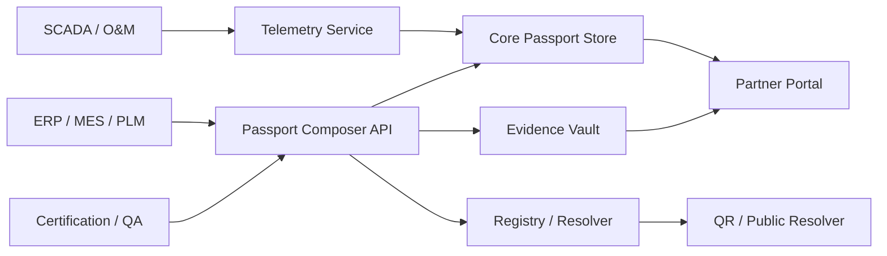

# PV Digital Product Passport Product Documentation Pack

This folder contains a **product-development-ready markdown pack** for building a **Digital Product Passport (DPP) solution for photovoltaic (PV) solar modules/panels**.

## What is inside

- `00_MASTER_INDEX.md` — single combined entry point
- `01_product_vision_and_scope.md` — product vision, goals, personas, use cases
- `02_regulatory_landscape.md` — official regulatory baseline and certainty levels
- `03_product_requirements.md` — functional and non-functional requirements
- `04_pv_passport_data_schema.md` — deep data attribute catalogue and schema design
- `05_reference_architecture.md` — recommended system architecture
- `06_benchmark_battery_vs_pv.md` — benchmark of battery-passport maturity vs PV
- `07_waaree_gap_analysis.md` — readiness/gap analysis for Waaree Energies
- `08_implementation_roadmap.md` — delivery phases, milestones, team roles
- `09_research_sources.md` — curated source list used for this pack
- `PV_DPP_Combined_Dossier.md` — one long combined file for easy reading/export

## How to use this pack

1. Read `00_MASTER_INDEX.md`.
2. Use `03_product_requirements.md` as your working PRD baseline.
3. Use `04_pv_passport_data_schema.md` as the schema/backlog foundation.
4. Use `05_reference_architecture.md` for engineering design reviews.
5. Use `07_waaree_gap_analysis.md` for customer-specific tailoring.
6. Use `08_implementation_roadmap.md` to create Jira/ClickUp/Notion tasks.

## Important interpretation note

This pack separates data attributes into three certainty levels:

- **High certainty** — directly grounded in existing law/framework requirements or strong official DPP mechanics
- **Medium certainty** — strong industry-consensus / likely delegated-act candidates
- **Low certainty** — forward-looking design proposals useful for product differentiation

## Source baseline

Primary sources reviewed for this pack:

- ESPR / Ecodesign for Sustainable Products Regulation: https://eur-lex.europa.eu/eli/reg/2024/1781/eng
- EU Batteries Regulation / battery passport: https://eur-lex.europa.eu/legal-content/EN/TXT/?uri=CELEX%3A32023R1542
- BatteryPass Data Model: https://batterypass.github.io/BatteryPassDataModel/
- Fraunhofer CSP material passport work for photovoltaics: https://www.csp.fraunhofer.de/en/areas-of-research/material-analytics/material-passport-photovoltaics.html
- Recent PV DPP prototype reporting: https://www.pv-magazine.com/2025/06/03/european-initiative-introduces-digital-product-passport-prototype-for-pv-industry/
- W3C DID Core: https://www.w3.org/TR/did/
- W3C Verifiable Credentials: https://www.w3.org/news/2025/the-verifiable-credentials-2-0-family-of-specifications-is-now-a-w3c-recommendation/

Prepared on: 2026-04-08


---

# PV DPP Product Development Master Index

This is the **single navigation file** for the PV Digital Product Passport product documentation set.

## Objective

Build a **production-grade Digital Product Passport platform for PV modules** that is:
- aligned with the **ESPR DPP model**
- informed by the **battery passport implementation pattern**
- practical for **manufacturers, importers, installers, asset owners, service providers, refurbishers, recyclers, and regulators**
- extensible from **compliance-focused static data** to **dynamic lifecycle intelligence**

## Current strategic conclusion

### 1) There is not yet a battery-passport-equivalent PV schema
PV does **not yet** have the same level of sector-specific, ready-to-implement, regulated schema maturity that batteries have today.

### 2) The safest product strategy is a tiered schema
Your PV passport product should clearly separate:
- **Regulatory core**
- **Industry-ready supply chain and circularity layer**
- **Advanced operational / telemetry layer**

### 3) The best technical pattern is hybrid
Use:
- **structured cloud storage / database** for full records
- **hashes / immutable registry entries** for integrity
- **DID / VC** for certificates and issuer trust
- optional **blockchain anchoring** only where it adds multi-party trust

## Recommended reading order

1. `01_product_vision_and_scope.md`
2. `02_regulatory_landscape.md`
3. `03_product_requirements.md`
4. `04_pv_passport_data_schema.md`
5. `05_reference_architecture.md`
6. `06_benchmark_battery_vs_pv.md`
7. `07_waaree_gap_analysis.md`
8. `08_implementation_roadmap.md`

## Quick design decisions

### MVP should include
- Unique passport identity and QR/data-carrier model
- Manufacturer / importer / facility / product identity
- Product specifications and compliance documents
- Material composition and substances-of-concern layer
- EoL / dismantling / recycler-facing data
- Controlled access model
- Evidence/document hash model

### Phase 2 should include
- supplier-tier traceability
- due diligence reports
- chain-of-custody events
- refurbishment / reuse workflows
- certificate verification using VC/DID

### Phase 3 should include
- telemetry pointers
- degradation/performance analytics
- digital twin or asset performance layer
- cross-border interoperability APIs

## File map

- [README](README.md)
- [Product vision and scope](01_product_vision_and_scope.md)
- [Regulatory landscape](02_regulatory_landscape.md)
- [Product requirements](03_product_requirements.md)
- [PV passport data schema](04_pv_passport_data_schema.md)
- [Reference architecture](05_reference_architecture.md)
- [Benchmark: Battery vs PV](06_benchmark_battery_vs_pv.md)
- [Waaree gap analysis](07_waaree_gap_analysis.md)
- [Implementation roadmap](08_implementation_roadmap.md)
- [Research sources](09_research_sources.md)
- [Combined dossier](PV_DPP_Combined_Dossier.md)


---

# Product Vision and Scope

## Product name
**PV Digital Product Passport Platform**

## Product vision
A trusted digital passport platform for photovoltaic modules that combines:
- regulatory compliance,
- supply-chain traceability,
- circularity readiness,
- lifecycle evidence,
- and optional operational intelligence.

## Problem statement
PV modules are moving toward a more traceable, circular, and evidence-driven market model, but the ecosystem is still fragmented:
- regulations define the **DPP framework**, but not yet a fully mature PV-specific schema,
- manufacturing, compliance, recycling, and performance data live in disconnected systems,
- recyclers and refurbishers often lack machine-readable dismantling and material data,
- installers and buyers struggle to verify origin, compliance, and long-term performance evidence.

## Target users

### Primary
- PV manufacturers
- importers / EU economic operators
- compliance teams
- quality / certification teams
- recyclers and producer responsibility organizations

### Secondary
- EPCs / installers
- asset owners / operators
- insurers / financiers
- auditors / market surveillance bodies
- circular-economy marketplaces

## Product outcomes
The platform should help customers:
1. create a machine-readable PV passport,
2. keep it updated across the lifecycle,
3. expose the right information to the right stakeholders,
4. prove integrity and provenance,
5. support reuse / recycling and EoL workflows.

## Core product modules

### 1. Passport registry
- passport creation
- unique IDs
- QR/data carrier resolution
- current-status lookup

### 2. Compliance document vault
- declarations
- test reports
- certificates
- manuals
- safety information
- versioning and integrity hashes

### 3. Material and BOM intelligence
- module material breakdown
- substances of concern
- supplier mapping
- recyclability guidance

### 4. Supply-chain and due-diligence layer
- actor registry
- facilities
- supplier tiers
- chain-of-custody events
- audit evidence

### 5. Circularity and EoL layer
- dismantling instructions
- collection scheme references
- refurbish / second-life workflows
- recovery outcome reporting

### 6. Optional performance layer
- telemetry connectors
- degradation summaries
- maintenance history
- anomaly / failure events

## Product boundaries

### In scope
- product passport platform
- evidence and document orchestration
- structured schema and APIs
- controlled-access information sharing
- optional trust / verification layer

### Out of scope for MVP
- full SCADA platform
- inverter / plant analytics replacement
- broad ERP replacement
- direct certification lab software replacement

## Suggested packaging

### Edition A — Compliance Core
For manufacturers beginning DPP readiness.

### Edition B — Traceability and Circularity
Adds supply-chain and EoL intelligence.

### Edition C — Lifecycle Intelligence
Adds dynamic performance and predictive analytics.

## Success metrics
- time to create passport
- % passports with complete regulatory core
- % passports with verified supporting evidence
- recycler usability score
- % passports with reusable structured BOM
- customer onboarding time
- passport update latency


---

# Regulatory Landscape

## Executive interpretation
For PV modules, the **ESPR** provides the horizontal DPP framework, but a fully product-specific PV passport requirement will depend on a future **delegated act**. That means some design choices are already firm, while others are still product-strategy decisions.

## 1. High-certainty regulatory foundations

### ESPR (EU) 2024/1781
Source: https://eur-lex.europa.eu/eli/reg/2024/1781/eng

What is clear already:
- the DPP must be linked to a **persistent unique product identifier**
- DPP data must be reachable through a **data carrier**
- DPPs must support **interoperability**
- access and update rights must be controlled
- data integrity, authentication, security, and privacy must be ensured
- delegated acts decide the exact product-group data requirements

### EU Batteries Regulation 2023/1542
Source: https://eur-lex.europa.eu/legal-content/EN/TXT/?uri=CELEX%3A32023R1542

Why it matters for PV:
- it is the most mature real-world EU passport model
- it proves the viability of:
  - public / legitimate-interest / authority access tiers
  - model-level + item-level + use-phase information
  - QR-linked passport access
  - controlled update and integrity mechanisms

### Practical takeaway
Use the **battery passport as the architectural template**, but do **not** claim PV has the same legal data obligations yet.

## 2. Medium-certainty compliance anchors relevant to PV

### REACH
Operational relevance:
- substances of very high concern communication
- article-level substance transparency
- structured BOM/substance model becomes highly valuable

### RoHS
Operational relevance:
- hazardous substance compliance signalling
- useful for product and market documentation layers

### WEEE
Operational relevance:
- end-of-life obligations
- collection / treatment / recycling support
- strong case for dismantling and recovery data in the passport

### Construction Products Regulation (context-dependent)
Relevance depends on:
- building-integrated PV use cases
- whether the product is treated in practice as a construction product in the target scenario

## 3. Low- to medium-certainty areas
These are strategically useful but not yet fully locked for PV:
- exact access-tier matrices
- mandatory PV product-level field list
- item-level vs model-level granularity
- required dynamic operational fields
- legally required circularity KPIs beyond general DPP direction

## 4. Mandatory vs voluntary thinking for product design

### Treat as mandatory-ready
- unique product / passport identity
- economic operator identification
- core product specifications
- compliance documentation links
- instruction / safety document access
- integrity model and access control
- versioning / auditability

### Treat as industry-consensus layer
- BOM and material composition
- substances-of-concern details
- facility-level provenance
- dismantling and EoL instructions
- due-diligence reports
- chain-of-custody events

### Treat as advanced / forward-looking
- real-time telemetry
- module-level operating analytics
- degradation prediction models
- asset marketplace reuse scoring
- digital twin integration

## 5. Lifecycle-stage reporting obligations model

### Manufacturing
- product identity
- manufacturer
- facility
- specs
- declarations
- certificates
- material profile

### Distribution / placing on market
- importer / distributor references
- lot/batch / shipment traceability
- market-specific documentation

### Use phase
- owner/operator linkage where contractually relevant
- maintenance events
- performance summaries
- fault / incident history

### End of life
- collection route
- dismantling guidance
- recycler receipt
- recovery outcomes
- disposal / recycling evidence

## Product implication
Build the product so that **regulatory core is immutable enough for audit**, while **industry extensions remain configurable** by customer, geography, and product type.


---

# Product Requirements

## Functional requirements

### FR-1 Passport creation
The system shall create a unique PV passport record for:
- product model
- batch / lot
- individual module where applicable

### FR-2 Identity resolution
The system shall resolve a QR code / data carrier to:
- public passport view
- authorized stakeholder views
- latest approved version

### FR-3 Evidence management
The system shall store or reference:
- declarations of conformity
- certificates
- manuals
- safety documents
- EPD / carbon documents
- test reports

### FR-4 Structured schema support
The system shall support:
- static product attributes
- material composition
- supply-chain entities
- circularity/EoL data
- optional dynamic performance data

### FR-5 Access control
The system shall support role-based access for:
- public
- manufacturer
- importer
- auditor/certifier
- recycler
- authority / regulator
- customer / asset owner
- service partner

### FR-6 Change management
The system shall:
- version all passport updates
- preserve audit history
- track who changed what and when
- allow approval workflows for sensitive data

### FR-7 Integrity
The system shall:
- hash referenced documents
- protect signed/approved fields from tampering
- maintain evidence provenance

### FR-8 Interoperability
The system shall provide:
- APIs
- import/export templates
- JSON schema-based exchange
- optional VC/DID support for trusted credentials

### FR-9 Circularity support
The system shall support:
- dismantling instructions
- reuse / refurbishment state changes
- recycler handover
- recovery reporting

### FR-10 Optional lifecycle intelligence
The system should support:
- telemetry pointers
- cumulative generation
- maintenance logs
- degradation indicators

## Non-functional requirements

### NFR-1 Security
- encryption at rest and in transit
- strong authentication
- tenant isolation
- signed audit logs

### NFR-2 Scalability
Must scale across:
- multiple customers
- multiple product lines
- millions of modules
- high document volumes

### NFR-3 Availability
- high availability for public passport resolution
- backup copy strategy
- archival strategy after company/tenant inactivity

### NFR-4 Regulatory explainability
Every important field should have:
- source
- owner
- update responsibility
- confidence / certainty classification

### NFR-5 Extensibility
New delegated-act fields must be added without platform redesign.

## User stories

### Manufacturer compliance manager
As a compliance manager, I want to generate a passport from ERP/MES/PLM data so that I can place products on the market with lower manual effort.

### Recycler
As a recycler, I want material composition and dismantling guidance so that I can process modules safely and efficiently.

### Buyer / installer
As a buyer, I want to verify identity, compliance, and warranty data from a QR code so that I can trust the product.

### Auditor / authority
As an auditor, I want a tamper-evident change log and source documents so that I can verify claims.

## MVP acceptance criteria
- passport can be created and resolved from QR
- public and restricted views work
- compliance docs can be attached and hashed
- material composition can be represented structurally
- EoL / dismantling data can be added
- all changes are auditable


---

# PV Passport Data Schema

## Schema design principle
Design the schema in 3 layers:

1. **Regulatory core (high certainty)**
2. **Industry consensus extensions (medium certainty)**
3. **Advanced lifecycle intelligence (low certainty / differentiating)**

---

## 1. Regulatory core fields (high certainty or safest baseline)

### 1.1 Identity
- `pvPassportId`
- `moduleIdentifier`
- `serialNumber`
- `batchId`
- `modelId`
- `gtin`
- `dataCarrierType`
- `passportVersion`
- `passportStatus`

### 1.2 Economic operators
- `manufacturer.name`
- `manufacturer.operatorIdentifier`
- `manufacturer.address`
- `manufacturer.contactUrl`
- `importer.name`
- `importer.operatorIdentifier`
- `authorizedRepresentative`
- `distributor[]`

### 1.3 Facilities
- `manufacturingFacility.facilityIdentifier`
- `manufacturingFacility.name`
- `manufacturingFacility.location`
- `manufacturingDate`

### 1.4 Product technical data
- `moduleCategory`
- `moduleTechnology`
- `ratedPowerSTC_W`
- `moduleEfficiency_percent`
- `voc_V`
- `isc_A`
- `vmp_V`
- `imp_A`
- `maxSystemVoltage_V`
- `moduleDimensions_mm`
- `moduleMass_kg`

### 1.5 Compliance and documentation
- `declarationOfConformity`
- `technicalDocumentationRef`
- `certificates[]`
- `userManual`
- `installationInstructions`
- `safetyInstructions`

---

## 2. Industry-consensus fields (medium certainty)

### 2.1 BOM and material composition
- `moduleMaterials[]`
  - `materialName`
  - `componentType`
  - `mass_g`
  - `massPercent`
  - `casNumber`
  - `isCriticalRawMaterial`
  - `supplierId`
  - `recyclabilityHint`

### 2.2 Substances and compliance
- `substancesOfConcern[]`
  - `name`
  - `casNumber`
  - `concentration_w_w_percent`
  - `regulatoryBasis`
- `reachStatus`
- `rohsStatus`

### 2.3 Carbon and sustainability
- `epdRef`
- `carbonFootprint`
  - `declaredValue_kgCO2e`
  - `boundary`
  - `methodology`
  - `verificationRef`
- `recycledContent[]`
- `renewableContent_percent`

### 2.4 Reliability and warranty
- `productWarranty_years`
- `performanceWarranty`
- `linearDegradation_percent_per_year`
- `expectedLifetime_years`
- `testStandards[]`

### 2.5 Supply chain
- `supplyChainActors[]`
- `supplyChainFacilities[]`
- `supplierTiers[]`
- `chainOfCustodyEvents[]`
- `supplyChainDueDiligenceReport`
- `thirdPartyAssurances[]`

### 2.6 Circularity and EoL
- `dismantlingAndRemovalInformation[]`
- `repairabilityNotes`
- `sparePartSources[]`
- `collectionScheme`
- `endOfLifeInformation`
- `recyclerInformation`
- `recoveryOutcomes[]`

---

## 3. Advanced lifecycle intelligence fields (low certainty / product differentiators)

### 3.1 Operational summaries
- `currentActivePower_W`
- `cumulativeEnergyGeneration_kWh`
- `cumulativeIrradiance_kWh_m2`
- `moduleTemperature_C`
- `ambientTemperature_C`
- `operatingHours_h`

### 3.2 Health / degradation
- `powerRetention_percent`
- `estimatedDegradationRate_percent_per_year`
- `anomalyFlags[]`
- `negativeEvents[]`

### 3.3 Service history
- `maintenanceEvents[]`
- `inspectionEvents[]`
- `componentReplacementEvents[]`

### 3.4 Digital evidence layer
- `telemetry.endpoint`
- `telemetry.manifestHash`
- `telemetry.accessPolicy`
- `evidenceRefs[]`
- `documentHashes[]`

---

## Canonical example object

```json
{
  "pvPassportId": "PVP-0000001",
  "moduleIdentifier": "MOD-123456789",
  "modelId": "WM-550N-TOPCON",
  "manufacturer": {
    "name": "Example Manufacturer",
    "operatorIdentifier": "EO-12345",
    "contactUrl": "https://example.org"
  },
  "manufacturingFacility": {
    "facilityIdentifier": "FAC-IND-001",
    "location": "India"
  },
  "manufacturingDate": "2026-01-12T00:00:00Z",
  "moduleTechnology": "crystalline_silicon_topcon",
  "ratedPowerSTC_W": 550,
  "moduleEfficiency_percent": 21.3,
  "compliance": {
    "declarationOfConformity": {
      "uri": "https://example.org/docs/doc.pdf",
      "hashAlg": "sha256",
      "hash": "abc123"
    }
  },
  "materialComposition": {
    "moduleMaterials": [
      {
        "materialName": "glass",
        "mass_g": 12000
      },
      {
        "materialName": "aluminium",
        "mass_g": 1800
      }
    ]
  },
  "endOfLife": {
    "status": "in_use"
  }
}
```

## Product recommendation
Implement the schema as:
- JSON schema for API/data exchange
- relational/document persistence model for operations
- optional VC credentialSubject model for certificates
- event model for lifecycle updates


---

# Reference Architecture

## Architectural recommendation
Use a **hybrid architecture**.

## Why hybrid is best
A pure centralized design is easy but weaker for cross-company trust.
A pure blockchain design is expensive, rigid, and poor for high-volume documents and telemetry.
A hybrid design gives:
- strong interoperability
- lower cost
- better privacy
- selective immutability
- easier enterprise integration

## Reference stack

### Layer 1 — Resolution and registry
Purpose:
- resolve QR / data carrier
- expose latest passport pointer
- store status and manifest references

Recommended contents:
- passport ID
- product ID
- latest manifest hash
- latest public endpoint
- lifecycle status
- revocation / supersession flags

Possible implementation:
- conventional trusted registry service
- optional blockchain anchoring for hash commitments

### Layer 2 — Core passport store
Purpose:
- hold structured passport JSON
- manage versions
- role-based access control
- approval workflow

Recommended technology:
- PostgreSQL / document store
- object storage for large files
- API gateway

### Layer 3 — Evidence and document vault
Purpose:
- store declarations, certificates, manuals, test reports, EPDs
- preserve integrity hashes
- enable signed retrieval and access control

### Layer 4 — Trust and verification layer
Purpose:
- represent issuers and certifiers
- verify claims cryptographically
- support machine-verifiable documents

Recommended standards:
- DID Core
- Verifiable Credentials

### Layer 5 — Telemetry and lifecycle intelligence layer
Purpose:
- connect SCADA / IoT / monitoring
- store summaries and pointers
- avoid bloating the core passport with raw time series

### Layer 6 — Integration layer
Connectors to:
- ERP
- MES
- PLM
- LCA/EPD systems
- certification systems
- recycler portals
- customer portals

## Access-control model

### Public
- identity
- manufacturer
- top-level specs
- declarations/certificates summary
- warranty
- general EoL guidance

### Legitimate-interest users
- detailed composition
- dismantling data
- recycler-facing data
- selected operational summaries

### Authorities / auditors
- deeper evidence
- approval logs
- restricted facility/supply-chain records
- complete compliance trace

## Static vs dynamic handling

### Static data
Store as structured passport snapshots.

### Dynamic data
Do not continuously rewrite the full passport for every telemetry event.
Instead:
- store time-series elsewhere
- periodically summarize into passport fields
- link evidence manifests by hash

## Minimal architecture diagram



## Build recommendation
For the first release, keep blockchain **optional**.
Make the product successful even without blockchain, then enable anchoring where customer trust and cross-party auditability justify it.


---

# Benchmark: Battery Passport vs PV Passport Maturity

## Short answer
Battery passports are currently more mature than PV passports.

## Why batteries are ahead
- batteries already have a **sector-specific EU passport mandate**
- battery passport access tiers are clearer
- BatteryPass provides a concrete reference data model
- the ecosystem has converged further on modular data domains

## Comparative maturity table

| Area | Battery Passport | PV Passport |
|---|---|---|
| EU sector-specific mandate | Stronger | Emerging through ESPR framework |
| Ready reference model | Yes | Not yet equivalent |
| Product-specific field maturity | Higher | Medium to low |
| Use-phase data precedent | Strong | Emerging / optional |
| Circularity field maturity | Higher | Growing but fragmented |
| Industry convergence | Higher | Still forming |
| Recommended architecture pattern | Mature hybrid pattern | Best to borrow from battery model |

## BatteryPass modules worth reusing conceptually
- General product information
- Material composition
- Circularity
- Performance and durability
- Supply chain due diligence
- Carbon footprint

## What PV should reuse
Reuse the **structure**, not the battery-specific physics:
- identity model
- access tier thinking
- modular schema design
- evidence hashing
- verifiable credentials for trusted documentation
- lifecycle status model
- EoL / recycler data emphasis

## What PV must change
Replace battery-centric fields with PV-native ones:
- chemistry -> module technology
- energy throughput -> cumulative energy generation
- capacity fade -> power retention / degradation
- cell-specific battery events -> PV failure / hotspot / PID / delamination events

## Product strategy recommendation
Treat the battery-passport ecosystem as:
- **architectural benchmark**
- **data-modelling benchmark**
- **governance benchmark**

But present the PV schema as:
- **PV-specific**
- **delegated-act ready**
- **extensible until regulation hardens**


---

# Waaree Energies Gap Analysis

## Objective
Assess likely readiness of Waaree Energies for a PV Digital Product Passport implementation.

## Important note
This is a **product-strategy gap analysis**, not a legal opinion or an internal Waaree system audit.
It should be used as a structured working hypothesis for solution design and discovery workshops.

## What a company like Waaree is likely to already have
A large PV manufacturer typically already tracks some portion of:
- product model and technical specifications
- manufacturing data
- test and certification documents
- warranty-related information
- batch/lot production data
- quality-control outputs
- export / compliance paperwork

## What is usually partial or fragmented
- deep structured BOM
- supplier-tier traceability beyond direct suppliers
- article-level substances-of-concern communication model
- digitally linked EPD/carbon evidence at product or plant granularity
- recycler-facing dismantling and recovery data
- standardized machine-readable chain-of-custody data
- verifiable-credential style trust model

## Likely readiness assessment by category

| Capability area | Likely readiness | Notes |
|---|---|---|
| Product identity and specs | High | Usually available in ERP/PLM/technical docs |
| Manufacturing records | Medium to high | Often available but not passport-ready |
| Certifications and test reports | High | Usually document-based, not always structured |
| Material composition | Medium | May exist partially, often not normalized |
| Supplier-tier traceability | Low to medium | Usually fragmented beyond Tier 1 |
| Circularity / recycling data | Low to medium | Often weakest enterprise data layer |
| Dynamic operational data | Low at module-passport level | Usually plant/system-level, not module-passport-ready |
| Trust / VC / DID readiness | Low | Usually not in current stack |

## Gap vs target PV DPP

### Gap 1 — Schema normalization
Need:
- machine-readable structured product schema
- consistent product, batch, and optional item identity

### Gap 2 — Material transparency
Need:
- deeper material declaration model
- substance and CRM flags
- supplier-linked evidence

### Gap 3 — EoL / recycler usability
Need:
- dismantling instructions
- recovery routing
- recovery outcome reporting model

### Gap 4 — Multi-stakeholder access control
Need:
- public vs restricted passport views
- evidence permissioning
- authority/auditor workflows

### Gap 5 — Trust and evidence integrity
Need:
- document hashing
- signed approvals
- certifier-issued verifiable claims

## Recommended Waaree-focused deployment path

### Phase A
- create regulatory core passport
- digitize current docs
- unify product and manufacturing identity

### Phase B
- add material composition and substance layer
- add supplier and facility evidence mapping

### Phase C
- add circularity / recycler data
- add due diligence workflows
- add optional VC/DID trust layer

### Phase D
- add dynamic asset and degradation intelligence where commercially useful

## Discovery questions for a Waaree workshop
1. What systems hold model, batch, and serial-level data?
2. Is BOM available at module level or only engineering level?
3. Which supplier tiers are digitally traceable?
4. How are EPD/carbon figures currently produced and verified?
5. What recycler / EoL data is currently maintained?
6. What approvals and signatures are already digitized?
7. Which customer/export markets are priority for DPP readiness?


---

# Implementation Roadmap

## Delivery philosophy
Build in 3 major waves:
1. **Compliance Core**
2. **Traceability + Circularity**
3. **Lifecycle Intelligence**

---

## Wave 1 — Compliance Core (MVP)

### Goals
- launch a usable passport platform
- support regulatory-core data
- prove document integrity and passport resolution

### Deliverables
- passport identity service
- QR/data-carrier resolution
- public/restricted views
- product schema v1
- document vault with hashing
- admin portal for manufacturers
- basic audit trail
- importer/manufacturer/facility data model

### Success criteria
- a manufacturer can create, publish, and update a passport
- public users can resolve the passport
- auditors can view version history
- evidence documents are integrity-protected

---

## Wave 2 — Traceability and Circularity

### Goals
- expand toward full DPP readiness
- improve supply-chain and EoL usefulness

### Deliverables
- supplier and facility registry
- BOM/material composition workflows
- substances-of-concern model
- due diligence report model
- chain-of-custody events
- dismantling and recycler workflows
- recovery outcome reporting

### Success criteria
- recycler can use the passport operationally
- manufacturer can publish structured material data
- supply-chain evidence is linked to product records

---

## Wave 3 — Lifecycle Intelligence

### Goals
- differentiate the platform commercially
- enable value after compliance

### Deliverables
- telemetry pointer architecture
- maintenance history
- degradation summaries
- anomaly event model
- portfolio analytics
- optional digital twin layer
- resale / second-life scoring

### Success criteria
- passport becomes useful after sale, not just at placing-on-market time
- asset owners/operators gain measurable operational value

---

## Team roles

### Product / domain lead
Owns:
- scope
- schema prioritization
- regulatory interpretation

### Compliance lead
Owns:
- field justification
- evidence requirements
- geographic rollout logic

### Solution architect
Owns:
- system decomposition
- security model
- integration pattern

### Backend team
Owns:
- APIs
- data model
- access control
- versioning

### Frontend team
Owns:
- manufacturer portal
- public passport viewer
- restricted stakeholder views

### Data / integration engineer
Owns:
- ERP/MES/PLM connectors
- import templates
- evidence ingestion

### Trust / identity engineer
Owns:
- DID/VC integration
- certificate verification
- trust registry

---

## Suggested backlog epics
- EPIC-01 Passport identity and registry
- EPIC-02 Product schema and validation
- EPIC-03 Evidence vault and hashing
- EPIC-04 Access control and tenanting
- EPIC-05 BOM and materials
- EPIC-06 Supply-chain graph
- EPIC-07 Circularity and recycling
- EPIC-08 Dynamic performance layer
- EPIC-09 Trust / VC / DID
- EPIC-10 Reporting and analytics

## Decision gates
Before each wave, confirm:
- target geography
- target product scope
- minimum regulatory interpretation
- customer data availability
- whether blockchain anchoring is truly needed


---

# Research Sources

## Primary sources

1. **ESPR / Ecodesign for Sustainable Products Regulation**
   - https://eur-lex.europa.eu/eli/reg/2024/1781/eng

2. **EU Batteries Regulation / battery passport**
   - https://eur-lex.europa.eu/legal-content/EN/TXT/?uri=CELEX%3A32023R1542

3. **BatteryPass Data Model**
   - https://batterypass.github.io/BatteryPassDataModel/

4. **Fraunhofer CSP — material passport photovoltaics**
   - https://www.csp.fraunhofer.de/en/areas-of-research/material-analytics/material-passport-photovoltaics.html

5. **PV DPP prototype coverage**
   - https://www.pv-magazine.com/2025/06/03/european-initiative-introduces-digital-product-passport-prototype-for-pv-industry/

6. **W3C DID Core**
   - https://www.w3.org/TR/did/

7. **W3C Verifiable Credentials**
   - https://www.w3.org/news/2025/the-verifiable-credentials-2-0-family-of-specifications-is-now-a-w3c-recommendation/

## How these sources were used

- **ESPR** — DPP mechanics, interoperability, access/update control, identifier/data-carrier logic
- **Batteries Regulation** — strongest benchmark for passport structure and access tiers
- **BatteryPass** — reference for modular schema design
- **Fraunhofer / PV initiative sources** — evidence that PV passport work is active but less mature
- **W3C DID / VC** — trust architecture for verifiable documentation

## Caution
This source set is strong enough to guide **product design** and **schema strategy**, but a final production/legal rollout still needs:
- product-group delegated-act monitoring,
- country-specific regulatory/legal review,
- customer discovery on data availability,
- and implementation-level security/privacy review.


---

## Frontend Product Development Addendum

This documentation pack now includes a dedicated frontend product layer so the DPP can be developed as a **real SaaS product**, not just a data schema. The added frontend files define:
- product surfaces
- information architecture
- screen-by-screen specs
- reusable UI components
- user flows and page states
- integration contracts
- delivery backlog
- wireframes
- button and microcopy catalogs

Use these files for implementation:
- `11_frontend_product_blueprint.md`
- `12_frontend_information_architecture.md`
- `13_frontend_screen_specifications.md`
- `14_design_system_and_component_library.md`
- `15_frontend_user_flows_and_states.md`
- `16_frontend_data_binding_and_api_contracts.md`
- `17_frontend_delivery_backlog.md`
- `18_wireframes_and_layout_patterns.md`
- `19_cta_and_microcopy_catalog.md`

Frontend design assumptions used:
- public mobile-first QR experience
- authenticated desktop-first operations workspace
- GS1-style identifier and resolution readiness
- DID/VC-ready trust surfaces
- WCAG 2.2-aligned component behavior
